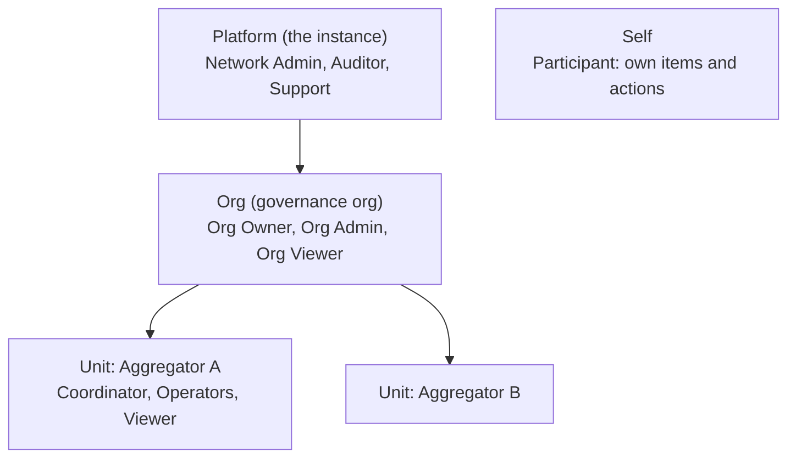
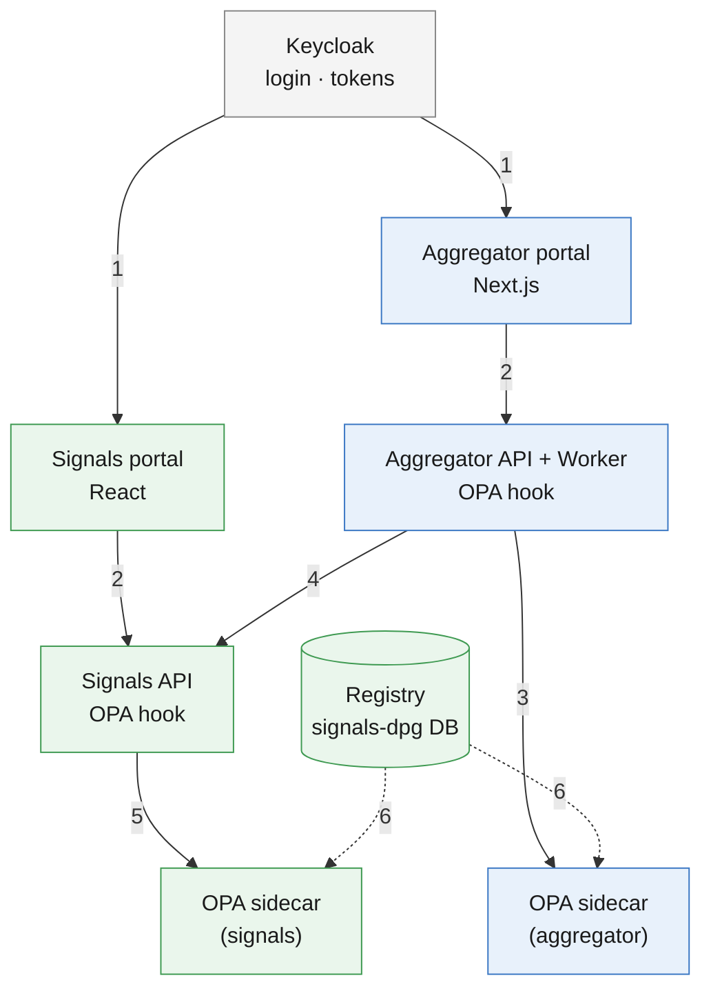
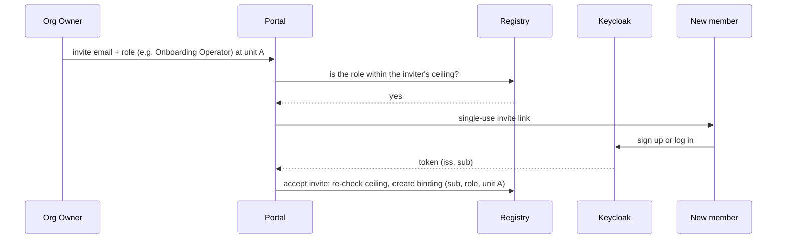
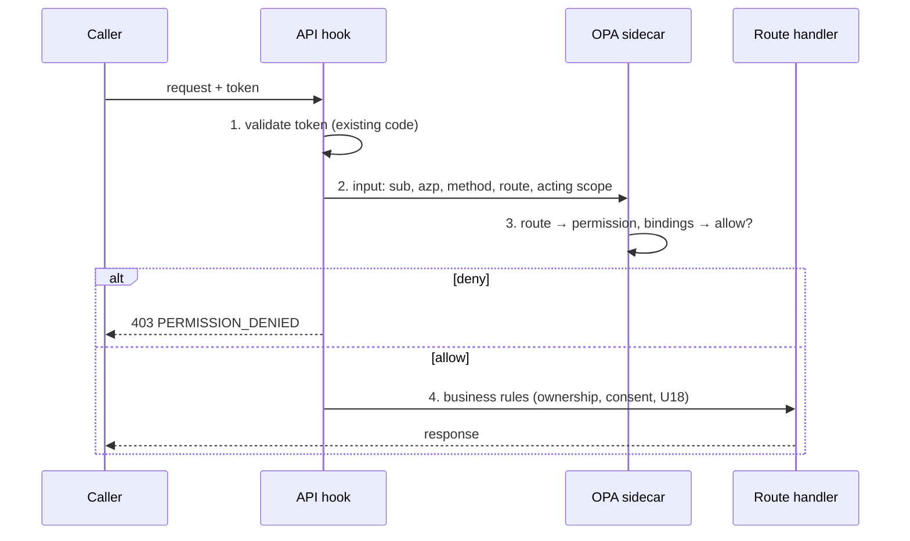

# RBAC Design — signals-dpg and aggregator-dpg

## Summary

One role-based access model for both portals:

- The permission list is fixed in code.
- Default roles ship with it.
- Admins build custom roles by picking permissions from the list.

Roles live in a registry in signals-dpg. OPA makes every allow/deny decision from a bundle the registry publishes. The permissions and roles are listed in [rbac-permissions-and-roles.md](rbac-permissions-and-roles.md).

## Highlights

| Item        | Decision                                                                                                                              |
| ----------- | ------------------------------------------------------------------------------------------------------------------------------------- |
| Permissions | 24, fixed in code. No one can add a permission at runtime.                                                                            |
| Roles       | 11 default human roles, 5 service roles, plus custom roles built from the list                                                        |
| Scope       | A role is granted _at_ a level: platform, org, unit or self. It applies to that level and everything below.                           |
| Registry    | Tables in signals-dpg for roles, bindings, entitlements and audit. Publishes an OPA bundle.                                           |
| Decision    | An OPA sidecar next to each API. One generic hook per API asks OPA; routes carry no permission code. The Keycloak token is unchanged. |

---

## 1. Today

Neither project has permissions. Access rests on:

- login
- item ownership
- `user.role='admin'`
- the acting org's type
- token claims such as `aggregator_id`

Every approved coordinator can do everything, including exporting decrypted PII.

Fix these gaps first:

| #   | Gap                                                                                                                                                                                                        | Where                                                      |
| --- | ---------------------------------------------------------------------------------------------------------------------------------------------------------------------------------------------------------- | ---------------------------------------------------------- |
| 1   | A logged-in person may be able to act as the network-wide org and decrypt every participant. Sign-in creates org membership from a token claim. The acting-org check then accepts membership of _any_ org. | signals `provisioning.ts:500-535`, `acting_org.ts:176-193` |
| 2   | Any service key can act for any org (`signals_acting_orgs="*"`)                                                                                                                                            | signals `acting_org.ts:25-38`                              |
| 3   | aggregator-dpg calls signals-dpg without saying which person is acting                                                                                                                                     | aggregator `signalstack-writer/src/http.ts:234-247`        |
| 4   | `role='admin'` skips the ownership check on item update                                                                                                                                                    | signals `update_item.ts:48`                                |
| 5   | A route with no auth hook is public by default, in both APIs                                                                                                                                               | both `apps/api/CLAUDE.md`                                  |

---

## 2. How the model works

| Term       | Meaning                                       | Example                             |
| ---------- | --------------------------------------------- | ----------------------------------- |
| Permission | One thing you can do, `<resource>:<action>`   | `participant:decrypt`               |
| Role       | A named set of permissions                    | Coordinator                         |
| Scope      | Where a role applies                          | Unit "Aggregator A"                 |
| Binding    | A person or service holding a role at a scope | Asha is Coordinator at Aggregator A |

Rules:

| Rule                       | Detail                                                                                                                                 |
| -------------------------- | -------------------------------------------------------------------------------------------------------------------------------------- |
| Down only                  | An org grant covers all its units. A unit grant gives nothing to the org or to sibling units.                                          |
| Many memberships           | A person can hold different roles in different units. The portal's unit switcher picks the active one.                                 |
| Custom roles               | Made by Network Admin (platform) or Org Owner (that org only). An org's roles are capped by its entitlement, which Network Admin sets. |
| No escalation              | You can only grant permissions within your own ceiling, and never to yourself                                                          |
| Business rules still apply | Consent, U18 limits and item lifecycle are checked after the permission check                                                          |

---

## 3. Options

| Option                                                         | Trade-off                                                                                                                                                                | Verdict    |
| -------------------------------------------------------------- | ------------------------------------------------------------------------------------------------------------------------------------------------------------------------ | ---------- |
| Keycloak roles and groups                                      | Built-in admin UI. But token roles are flat, so "Coordinator in unit A, Viewer in unit B" is hard to express.                                                            | No         |
| Registry as a federated store for Keycloak, roles in the token | Needs a Java plugin inside Keycloak. Login fails when the registry is down. Roles stay in the token for its 300 s life, so revocation waits. Saves only the role lookup. | No         |
| Registry + an evaluator written in each API                    | Every route needs permission code. Two evaluators must be kept identical. Also needs a role cache and a snapshot API.                                                    | No         |
| Registry + OPA bundle                                          | Adds one sidecar per API, and the team writes Rego. Routes and Keycloak stay unchanged. One policy serves both APIs.                                                     | **Chosen** |

---

## 4. Design

Blue boxes belong to aggregator-dpg, green to signals-dpg.

| Step | What happens                                                                                                                     |
| ---- | -------------------------------------------------------------------------------------------------------------------------------- |
| 1    | The user logs in to a portal; Keycloak issues a token (`iss`, `sub`, `azp`)                                                      |
| 2    | The portal sends the request, with the token, to its API                                                                         |
| 3    | The aggregator API asks its OPA sidecar whether to allow the request                                                             |
| 4    | When the request needs Signals data, the aggregator API calls the Signals API with its service token plus the acting user (§4.4) |
| 5    | The Signals API asks its own OPA sidecar whether to allow the request                                                            |
| 6    | The registry publishes roles and bindings as a bundle; both sidecars pull it every 30 s (§4.3)                                   |

### 4.1 How a user gets a role

A user holds a role only through a binding row: user, role, scope. The user is identified by the Keycloak token's issuer and `sub`. Roles are never written into Keycloak.

| Event                                        | Binding created                                | Done by                           |
| -------------------------------------------- | ---------------------------------------------- | --------------------------------- |
| First login to the Signals portal            | Participant at self (implicit, no row)         | Automatic                         |
| Network Admin approves an org                | Org Owner at that org, for the owner's account | Automatic on approval             |
| Org Owner/Admin approves a unit registration | Coordinator at that unit                       | Automatic on approval             |
| Invited member logs in                       | The invite's role, at the invite's org or unit | Automatic on first login          |
| Assign on the Members page                   | Any role within the granter's ceiling          | Org Owner, Org Admin, Coordinator |
| New instance                                 | Network Admin at platform                      | `create_admin_user.ts` script     |
| New service client                           | Service role at platform, for the client id    | Network Admin                     |

| Removal trigger            | Effect                                |
| -------------------------- | ------------------------------------- |
| Revoke on the Members page | Removes that binding                  |
| Offboarding a unit or org  | Removes every binding on it           |
| `expires_at` reached       | The binding lapses                    |
| Banning a user             | Removes the implicit Participant role |

Invite flow:

The invite stores the role and scope; `registration_invites` already has `role` and `parent_org_id` columns. The binding is created at acceptance, because the invitee has no `sub` before their first login.

### 4.2 From Keycloak token to decision

| Step               | What happens                                                                                                                                                               | New code?             |
| ------------------ | -------------------------------------------------------------------------------------------------------------------------------------------------------------------------- | --------------------- |
| 1. Validate token  | Signature, issuer, audience, expiry and `azp`. Signals reads the token held behind the `sid` cookie.                                                                       | No, exists today      |
| 2. Build OPA input | `sub`, `azp`, method, route pattern, acting scope from a header (`x-acting-unit` from the portal, or the existing `x-acting-org-id`), and `on_behalf_of` for service calls | One hook file per API |
| 3. OPA decides     | Finds the route's permission, then checks whether any of the caller's roles at that scope (or above) holds it                                                              | Rego policy           |
| 4. Business rules  | Ownership within the scope, consent, U18                                                                                                                                   | No, exists today      |

| Token claim                                                                   | Used for                                              |
| ----------------------------------------------------------------------------- | ----------------------------------------------------- |
| `iss`, `sub`                                                                  | Who the person is; looked up in the bundle's bindings |
| `azp`                                                                         | Which client is calling; identifies a service         |
| `aud`, `exp`                                                                  | Token validity                                        |
| `realm_access.roles`, `aggregator_id`, `decision_made`, `signals_acting_orgs` | Not used for access                                   |

Worked example:

| Item                   | Value                                                                               |
| ---------------------- | ----------------------------------------------------------------------------------- |
| Token                  | `sub=7f3c…`, `azp=aggregator-portal`                                                |
| Bindings in the bundle | Coordinator at unit A, Unit Viewer at unit B                                        |
| Request                | `POST /v1/dashboard/export/profiles`, acting unit B                                 |
| Route map              | `participant:decrypt` at the acting unit                                            |
| Decision               | Denied: Unit Viewer does not hold it. With acting unit A it is allowed and audited. |

### 4.3 OPA bundle and policy

The registry builds one bundle and serves it at `GET /iam/bundle`. Both OPA sidecars poll it.

| Bundle part | Contents                                                              | Source                                                             |
| ----------- | --------------------------------------------------------------------- | ------------------------------------------------------------------ |
| Policy      | Rego rules: scope inheritance, route lookup, deny by default          | signals-dpg `policy/rbac/`, tested with `opa test` in CI           |
| Roles       | Role → permissions, for default and custom roles                      | `iam_role`, `iam_role_permission`                                  |
| Bindings    | Every non-participant binding: principal, role, scope                 | `iam_binding` (operators and admins only; Participant is implicit) |
| Scope tree  | Unit → org → platform                                                 | signals `organization.parent_org_id`                               |
| Route map   | `METHOD /route` → permission and scope source, plus the public routes | Generated from the catalogue's "Enforced at" column                |

| Rule             | Detail                                                                                                                                                               |
| ---------------- | -------------------------------------------------------------------------------------------------------------------------------------------------------------------- |
| Deny by default  | A route not in the route map, and not marked public, is denied. This closes gap 5 without touching routes.                                                           |
| Refresh          | OPA polls every 30 s with an ETag. A role or binding change reaches both APIs within that time.                                                                      |
| PII checked live | Before decrypting, the signals decrypt handler re-checks the caller's binding in its own database, then writes the audit row. Revocation of PII access is immediate. |
| OPA unreachable  | The hook returns `503` and denies. OPA keeps serving its last good bundle; an alert fires if the bundle is older than 5 minutes.                                     |
| UI hiding        | `GET /iam/me` asks OPA for the caller's permissions at each scope. Both portals hide what the user cannot use; the API decision is the real control.                 |
| Decision log     | OPA logs every decision. In shadow mode (§6) the hook only logs.                                                                                                     |

### 4.4 Service-to-service calls

When aggregator-dpg calls signals-dpg for a person, it sends its service token, `x-acting-org-id` and `x-on-behalf-of: `. OPA allows only what both the service and the person hold.

| Call                                   | Effective access                                          |
| -------------------------------------- | --------------------------------------------------------- |
| Portal user → aggregator API → signals | Service role ∩ user's role at their unit                  |
| Worker job (bulk upload, campaign)     | Service role ∩ the role of the user who started the job   |
| Public QR registration (no user)       | Service role, limited to onboarding into that link's unit |
| Raya voice bot                         | Service role ∩ the OTP-verified caller's own data         |

Only service roles marked as allowed to delegate may send `x-on-behalf-of`. OPA ignores the header from any other caller.

### 4.5 Data

New tables in the signals-dpg database:

| Table                             | Holds                                                            |
| --------------------------------- | ---------------------------------------------------------------- |
| `iam_permission`                  | The 24 permissions, seeded from code                             |
| `iam_role`, `iam_role_permission` | Default and custom roles, and the permissions each role contains |
| `iam_binding`                     | Who holds which role, at which scope                             |
| `iam_org_entitlement`             | The permissions each org is allowed to use in custom roles       |
| `iam_audit`                       | Every role or binding change, and every PII access               |

Existing tables that change:

| Table                        | Change                                               |
| ---------------------------- | ---------------------------------------------------- |
| signals `organization`       | Gains `parent_org_id`, so each unit links to its org |
| aggregator `aggregator_orgs` | Gains `signalstack_org_id`                           |

---

## 5. What changes in each project

| Area           | signals-dpg                                                                                            | aggregator-dpg                                                                    |
| -------------- | ------------------------------------------------------------------------------------------------------ | --------------------------------------------------------------------------------- |
| New code       | Registry tables and API, bundle endpoint, OPA hook, Rego policy                                        | OPA hook                                                                          |
| Removed checks | `user.role='admin'`, acting-org type check, "member of any org"                                        | `requireApproved`, `decision_made`, `aggregator_id` as tenant                     |
| Routes         | Unchanged, except the decrypt handler's live check                                                     | Unchanged                                                                         |
| Deployment     | OPA sidecar in the API pod; `opa` service in local `docker-compose.yml`                                | Same                                                                              |
| Approvals      | -                                                                                                      | Approval creates a role binding. Email links open a portal page that needs login. |
| Org Owner      | -                                                                                                      | Logs in to the portal, instead of acting only through emailed links               |
| Pages          | Permission-aware menus                                                                                 | Members, Roles, Org console, Network Admin console                                |
| Keycloak       | Remove the `*` acting-org grant. Stop users editing their own attributes (`unmanagedAttributePolicy`). | Stop using `org_owner` and `decision_made` for access                             |

---

## 6. Rollout

| Phase | What ships                                                                                                                                                                                 | Done when                                      |
| ----- | ------------------------------------------------------------------------------------------------------------------------------------------------------------------------------------------ | ---------------------------------------------- |
| 0     | Fix the gaps in §1                                                                                                                                                                         | Each gap has a failing-then-passing test       |
| 1     | Registry, default roles, bundle endpoint, OPA sidecars. Existing users get matching roles: admin → Network Admin, approved coordinator → Coordinator at their unit, org owner → Org Owner. | Everyone keeps today's access                  |
| 2     | Shadow mode: OPA decides and logs; the old checks still decide                                                                                                                             | No unexplained differences for one release     |
| 3     | Enforce: signals-dpg first, then aggregator-dpg; remove the old checks                                                                                                                     | Old checks deleted                             |
| 4     | Portal pages: members, roles, org and admin consoles                                                                                                                                       | Approvals work without email-only links        |
| 5     | Custom roles and entitlements                                                                                                                                                              | An Org Owner creates and assigns a custom role |

`RBAC_ENFORCEMENT` (`off` / `shadow` / `enforce`) switches the hook between phases 2 and 3.

---

## 7. Open questions

| #   | Question                                                                           | Default                                       |
| --- | ---------------------------------------------------------------------------------- | --------------------------------------------- |
| 1   | Should Org Owner or Org Admin see decrypted PII?                                   | No, Coordinator only                          |
| 2   | Does the Network Admin console live in the aggregator portal or in a separate app? | Aggregator portal `/admin`                    |
| 3   | Can units own custom roles, or only platform and orgs?                             | Platform and orgs only                        |
| 4   | Keep emailed approval links as a shortcut?                                         | Yes, but they require login                   |
| 5   | If each DPG gets its own Keycloak realm, users no longer share one id across both  | Store users by issuer + id from the start     |
| 6   | OPA as a sidecar per API pod, or one central OPA service?                          | Sidecar: no network hop, and no shared outage |
| 7   | Is a 30 s delay for non-PII role changes acceptable?                               | Yes; PII access is checked live               |
