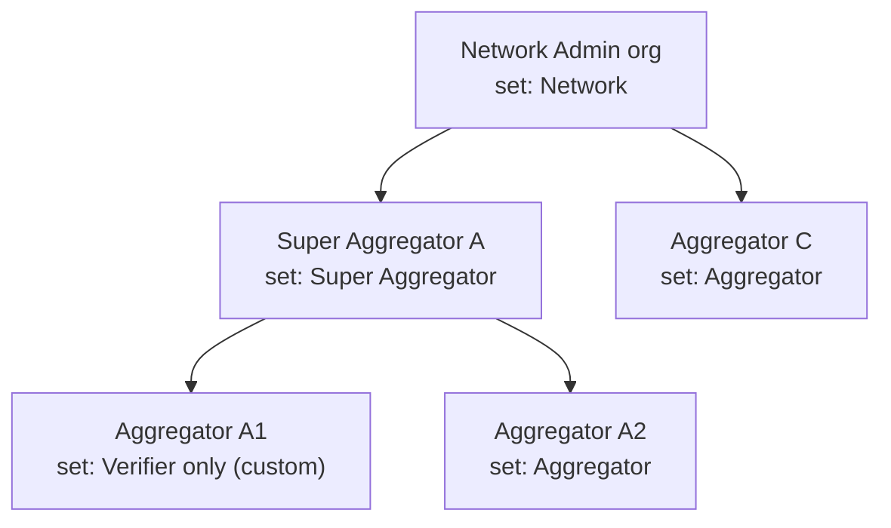
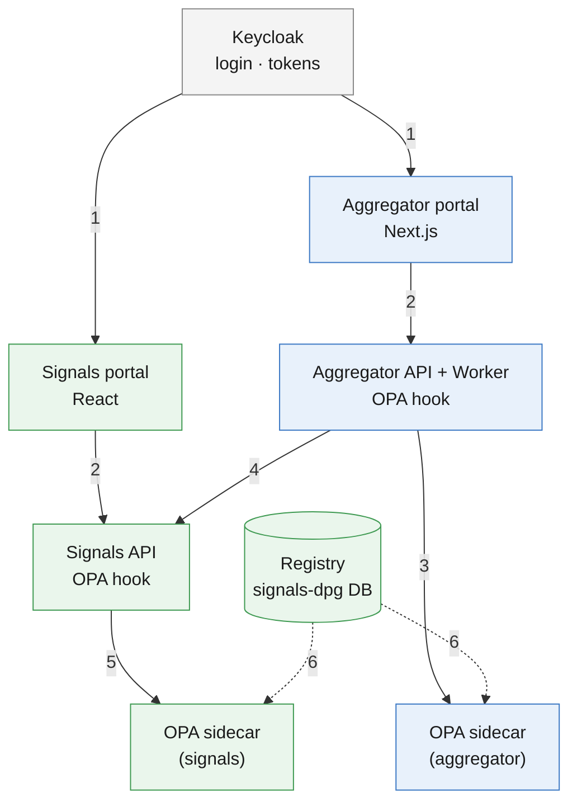
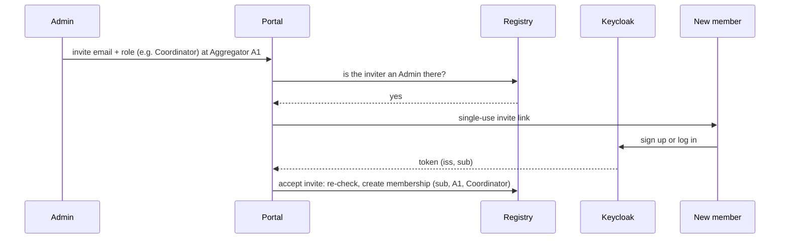

# RBAC Design — signals-dpg and aggregator-dpg

## Summary

One access model for both portals:

- Organisations hold a PermissionSet: a named list of capabilities.
- People hold roles inside their organisation.
- What a person may do is the organisation's set ∩ their roles.

OPA makes every decision from a bundle published by a registry in signals-dpg. The capabilities, PermissionSets and roles are listed in [rbac-permissions-and-roles.md](rbac-permissions-and-roles.md).

## Highlights

| Item          | Decision                                                                                                                     |
| ------------- | ---------------------------------------------------------------------------------------------------------------------------- |
| Capabilities  | 13, fixed in code, e.g. `profiles.view_pii`                                                                                  |
| Organisations | Each holds one PermissionSet, chosen by its parent and never larger than the parent's                                        |
| People        | 4 fixed roles: Admin, Coordinator, Viewer, PII Access (add-on). Personal data needs PII Access.                              |
| Registry      | signals-dpg tables for PermissionSets, organisation grants, memberships and audit. Published as an OPA bundle.               |
| Decision      | An OPA sidecar next to each API. One generic hook per API; routes carry no permission code. The Keycloak token is unchanged. |

---

## 1. Today

Neither project has permissions. Access rests on:

- login
- item ownership
- `user.role='admin'`
- the acting org's type
- token claims such as `aggregator_id`

Every approved coordinator can do everything, including exporting decrypted PII.

Fix these gaps first:

| #   | Gap                                                                                                                                                                                                        | Where                                                      |
| --- | ---------------------------------------------------------------------------------------------------------------------------------------------------------------------------------------------------------- | ---------------------------------------------------------- |
| 1   | A logged-in person may be able to act as the network-wide org and decrypt every participant. Sign-in creates org membership from a token claim. The acting-org check then accepts membership of _any_ org. | signals `provisioning.ts:500-535`, `acting_org.ts:176-193` |
| 2   | Any service key can act for any org (`signals_acting_orgs="*"`)                                                                                                                                            | signals `acting_org.ts:25-38`                              |
| 3   | aggregator-dpg calls signals-dpg without saying which person is acting                                                                                                                                     | aggregator `signalstack-writer/src/http.ts:234-247`        |
| 4   | `role='admin'` skips the ownership check on item update                                                                                                                                                    | signals `update_item.ts:48`                                |
| 5   | A route with no auth hook is public by default, in both APIs                                                                                                                                               | both `apps/api/CLAUDE.md`                                  |

---

## 2. How the model works

| Term          | Meaning                                               | Example                              |
| ------------- | ----------------------------------------------------- | ------------------------------------ |
| Capability    | One thing that can be done                            | `profiles.verify`                    |
| PermissionSet | A named list of capabilities, held by an organisation | "Verifier only"                      |
| Role          | What a person may do inside their organisation        | Coordinator                          |
| Membership    | A person holding one or more roles in an organisation | Asha is Coordinator at Aggregator A1 |

Organisations form a tree of any depth. Each one holds a PermissionSet:



| Rule                       | Detail                                                                                                      |
| -------------------------- | ----------------------------------------------------------------------------------------------------------- |
| Effective access           | Organisation's PermissionSet ∩ the person's roles                                                           |
| Subtree                    | Access applies to the person's organisation and every organisation beneath it, never to parents or siblings |
| Subset rule                | A child's PermissionSet can never exceed its parent's. Checked when the grant is made.                      |
| Separation of duties       | Admins grant PII Access but do not hold it by default. Nobody changes their own roles.                      |
| Business rules still apply | Consent, U18 limits and profile lifecycle are checked after the access check                                |

---

## 3. Options

| Option                                                         | Trade-off                                                                                                                                                                | Verdict    |
| -------------------------------------------------------------- | ------------------------------------------------------------------------------------------------------------------------------------------------------------------------ | ---------- |
| Keycloak roles and groups                                      | Built-in admin UI. But token roles are flat, so "Admin at org A, Viewer at org B" is hard to express.                                                                    | No         |
| Registry as a federated store for Keycloak, roles in the token | Needs a Java plugin inside Keycloak. Login fails when the registry is down. Roles stay in the token for its 300 s life, so revocation waits. Saves only the role lookup. | No         |
| Registry + an evaluator written in each API                    | Every route needs permission code. Two evaluators must be kept identical. Also needs a role cache and a snapshot API.                                                    | No         |
| Registry + OPA bundle                                          | Adds one sidecar per API, and the team writes Rego. Routes and Keycloak stay unchanged. One policy serves both APIs.                                                     | **Chosen** |

---

## 4. Design



Blue boxes belong to aggregator-dpg, green to signals-dpg.

| Step | What happens                                                                                                                     |
| ---- | -------------------------------------------------------------------------------------------------------------------------------- |
| 1    | The user logs in to a portal; Keycloak issues a token (`iss`, `sub`, `azp`)                                                      |
| 2    | The portal sends the request, with the token, to its API                                                                         |
| 3    | The aggregator API asks its OPA sidecar whether to allow the request                                                             |
| 4    | When the request needs Signals data, the aggregator API calls the Signals API with its service token plus the acting user (§4.4) |
| 5    | The Signals API asks its own OPA sidecar whether to allow the request                                                            |
| 6    | The registry publishes PermissionSets and memberships as a bundle; both sidecars pull it every 30 s (§4.3)                       |

### 4.1 How a person gets a role

A person holds roles only through a membership row: person, organisation, roles. The person is identified by the Keycloak token's issuer and `sub`. Nothing about roles is written into Keycloak.

| Event                                | Result                                                                                     | Done by                                      |
| ------------------------------------ | ------------------------------------------------------------------------------------------ | -------------------------------------------- |
| Network Admin setup                  | The Network Admin organisation, with the Network set; the first person is its Admin        | Backend team (`create_admin_user.ts` today)  |
| A parent approves a new organisation | The organisation gets the PermissionSet the parent chose; the registrant becomes its Admin | Automatic on approval                        |
| An invited person logs in            | The invite's roles in the invite's organisation                                            | Automatic on first login                     |
| Assign on the Members page           | Admin, Coordinator, Viewer or PII Access                                                   | An Admin of that organisation or an ancestor |
| New service client                   | The client's allowed capabilities (catalogue Appendix C)                                   | Network Admin                                |

| Removal trigger            | Effect                                        |
| -------------------------- | --------------------------------------------- |
| Revoke on the Members page | Removes that role                             |
| Blocking an organisation   | Removes every membership in it and beneath it |
| PII Access after 90 days   | Lapses unless renewed                         |
| Banning a person           | Removes all their access                      |

Invite flow:



The invite stores the roles and organisation; `registration_invites` already has `role` and `parent_org_id` columns. The membership is created at acceptance, because the invitee has no `sub` before their first login.

### 4.2 From Keycloak token to decision

```mermaid
sequenceDiagram
    participant C as Caller
    participant H as API hook
    participant O as OPA sidecar
    participant R as Route handler
    C->>H: request + token
    H->>H: 1. validate token (existing code)
    H->>O: 2. input: sub, azp, method, route, acting organisation
    O->>O: 3. route → capability; set ∩ roles → allow?
    alt deny
        H-->>C: 403 PERMISSION_DENIED
    else allow
        H->>R: 4. business rules (ownership, consent, U18)
        R-->>C: response
    end
```

| Step               | What happens                                                                                                                                                 | New code?             |
| ------------------ | ------------------------------------------------------------------------------------------------------------------------------------------------------------ | --------------------- |
| 1. Validate token  | Signature, issuer, audience, expiry and `azp`. Signals reads the token held behind the `sid` cookie.                                                         | No, exists today      |
| 2. Build OPA input | `sub`, `azp`, method, route pattern, acting organisation (from the portal session, or the existing `x-acting-org-id`), and `on_behalf_of` for service calls  | One hook file per API |
| 3. OPA decides     | Finds the route's capability. Allows it if, at the acting organisation or an ancestor, the organisation's set and one of the person's roles both include it. | Rego policy           |
| 4. Business rules  | Ownership within the subtree, consent, U18                                                                                                                   | No, exists today      |

| Token claim                                                                   | Used for                                                 |
| ----------------------------------------------------------------------------- | -------------------------------------------------------- |
| `iss`, `sub`                                                                  | Who the person is; looked up in the bundle's memberships |
| `azp`                                                                         | Which client is calling; identifies a service            |
| `aud`, `exp`                                                                  | Token validity                                           |
| `realm_access.roles`, `aggregator_id`, `decision_made`, `signals_acting_orgs` | Not used for access                                      |

Worked example:

| Item              | Value                                                                                                                       |
| ----------------- | --------------------------------------------------------------------------------------------------------------------------- |
| Token             | `sub=7f3c…`, `azp=aggregator-portal`                                                                                        |
| Memberships       | Admin at Aggregator A2                                                                                                      |
| Request           | `POST /v1/dashboard/export/profiles`, acting organisation A2                                                                |
| Capability needed | `profiles.view_pii`                                                                                                         |
| Decision          | Denied: A2's set holds it, but Admin does not. Once another Admin grants this person PII Access, it is allowed and audited. |

### 4.3 OPA bundle and policy

The registry builds one bundle and serves it at `GET /iam/bundle`. Both OPA sidecars poll it.

| Bundle part       | Contents                                                                                     | Source                                                                                        |
| ----------------- | -------------------------------------------------------------------------------------------- | --------------------------------------------------------------------------------------------- |
| Policy            | Rego rules: subtree, set ∩ roles, earned and not-yet-grantable capabilities, deny by default | signals-dpg `policy/rbac/`, tested with `opa test` in CI                                      |
| Roles             | The 4 roles and their capabilities                                                           | Code constants                                                                                |
| PermissionSets    | Default and custom sets                                                                      | `iam_permission_set`                                                                          |
| Organisation tree | Each organisation's parent, PermissionSet and Super Aggregator status                        | `organization`, `iam_org_grant`                                                               |
| Memberships       | Person, organisation, roles, expiry                                                          | `iam_membership` (organisation members only; seekers and providers follow self-service rules) |
| Route map         | `METHOD /route` → capability, plus the public routes                                         | Catalogue Appendix A                                                                          |

| Rule                       | Detail                                                                                                                                                    |
| -------------------------- | --------------------------------------------------------------------------------------------------------------------------------------------------------- |
| Deny by default            | A route not in the route map, and not marked public, is denied. This closes gap 5 without touching routes.                                                |
| Refresh                    | OPA polls every 30 s with an ETag. A change reaches both APIs within that time.                                                                           |
| Personal data checked live | Before decrypting, the signals decrypt handler re-checks the caller's PII Access in its own database, then writes the audit row. Revocation is immediate. |
| OPA unreachable            | The hook returns `503` and denies. OPA keeps serving its last good bundle; an alert fires if the bundle is older than 5 minutes.                          |
| UI hiding                  | `GET /iam/me` asks OPA for the caller's capabilities. Both portals hide what the person cannot use; the API decision is the real control.                 |
| Decision log               | OPA logs every decision. In shadow mode (§6) the hook only logs.                                                                                          |

### 4.4 Service-to-service calls

When aggregator-dpg calls signals-dpg for a person, it sends its service token, `x-acting-org-id` and `x-on-behalf-of: <sub>`. OPA allows only what both the client and the person hold. The clients are listed in catalogue Appendix C.

| Call                                   | Effective access                                                              |
| -------------------------------------- | ----------------------------------------------------------------------------- |
| Portal user → aggregator API → signals | Client ∩ person's access at their organisation                                |
| Worker job (bulk upload, campaign)     | Client ∩ access of the person who started the job, checked again when it runs |
| Public QR registration (no person)     | Client, limited to `profiles.onboard` into that link's organisation           |
| Raya voice bot                         | Client ∩ the OTP-verified caller's own data                                   |

Only clients marked as allowed to delegate may send `x-on-behalf-of`. OPA ignores the header from any other caller.

### 4.5 Data

New tables in the signals-dpg database:

| Table                                                 | Holds                                                                                      |
| ----------------------------------------------------- | ------------------------------------------------------------------------------------------ |
| `iam_capability`                                      | The 13 capabilities, seeded from code                                                      |
| `iam_permission_set`, `iam_permission_set_capability` | Default and custom PermissionSets and their capabilities                                   |
| `iam_org_grant`                                       | Each organisation's PermissionSet: who granted it, when, and from which invite or approval |
| `iam_membership`                                      | Person (`iss` + `sub`), organisation, role, granted by, expiry                             |
| `iam_audit`                                           | Every grant, change and revoke, and every use of personal data                             |

Existing tables that change:

| Table                        | Change                                                           |
| ---------------------------- | ---------------------------------------------------------------- |
| signals `organization`       | Gains `parent_org_id`, so organisations form a tree of any depth |
| aggregator `aggregator_orgs` | Gains `signalstack_org_id`                                       |

---

## 5. What changes in each project

| Area           | signals-dpg                                                                                            | aggregator-dpg                                                                                                |
| -------------- | ------------------------------------------------------------------------------------------------------ | ------------------------------------------------------------------------------------------------------------- |
| New code       | Registry tables and API, bundle endpoint, OPA hook, Rego policy                                        | OPA hook                                                                                                      |
| Removed checks | `user.role='admin'`, acting-org type check, "member of any org"                                        | `requireApproved`, `decision_made`, `aggregator_id` as tenant                                                 |
| Routes         | Unchanged, except the decrypt handler's live check                                                     | Unchanged                                                                                                     |
| Deployment     | OPA sidecar in the API pod; `opa` service in local `docker-compose.yml`                                | Same                                                                                                          |
| Approvals      | -                                                                                                      | Approval creates the organisation grant and its first Admin. Email links open a portal page that needs login. |
| Pages          | Permission-aware menus                                                                                 | Members (roles, PII Access expiry), PermissionSets, Organisation console, Network Admin console               |
| Keycloak       | Remove the `*` acting-org grant. Stop users editing their own attributes (`unmanagedAttributePolicy`). | Stop using `org_owner` and `decision_made` for access                                                         |

---

## 6. Rollout

| Phase | What ships                                                                        | Done when                                  |
| ----- | --------------------------------------------------------------------------------- | ------------------------------------------ |
| 0     | Fix the gaps in §1                                                                | Each gap has a failing-then-passing test   |
| 1     | Registry, default sets and roles, bundle endpoint, OPA sidecars, backfill (below) | Everyone keeps today's access              |
| 2     | Shadow mode: OPA decides and logs; the old checks still decide                    | No unexplained differences for one release |
| 3     | Enforce: signals-dpg first, then aggregator-dpg; remove the old checks            | Old checks deleted                         |
| 4     | Portal pages: members, PermissionSets, organisation and Network Admin consoles    | Approvals work without email-only links    |

`RBAC_ENFORCEMENT` (`off` / `shadow` / `enforce`) switches the hook between phases 2 and 3.

Backfill in phase 1:

| Today                                                | Becomes                                                                                                                                                 |
| ---------------------------------------------------- | ------------------------------------------------------------------------------------------------------------------------------------------------------- |
| signals `user.role='admin'`; the `ADMIN_EMAILS` list | Admin at the Network Admin organisation                                                                                                                 |
| Active `aggregator_orgs`                             | Super Aggregator set; its owner becomes Admin                                                                                                           |
| Approved aggregators (coordinators)                  | Aggregator set at their organisation; the coordinator becomes Admin + PII Access, keeping today's access. PII Access comes up for review after 90 days. |

---

## 7. Open questions

| #   | Question                                                                                   | Default                                       |
| --- | ------------------------------------------------------------------------------------------ | --------------------------------------------- |
| 1   | Who may grant PII Access: only an Admin of that organisation, or also Admins of ancestors? | Both                                          |
| 2   | Is 90 days the right PII Access expiry?                                                    | Yes                                           |
| 3   | Does the Network Admin console live in the aggregator portal or in a separate app?         | Aggregator portal `/admin`                    |
| 4   | Keep emailed approval links as a shortcut?                                                 | Yes, but they require login                   |
| 5   | If each DPG gets its own Keycloak realm, people no longer share one id across both         | Store people by issuer + id from the start    |
| 6   | OPA as a sidecar per API pod, or one central OPA service?                                  | Sidecar: no network hop, and no shared outage |
| 7   | Is a 30 s delay for non-PII changes acceptable?                                            | Yes; personal data is checked live            |
