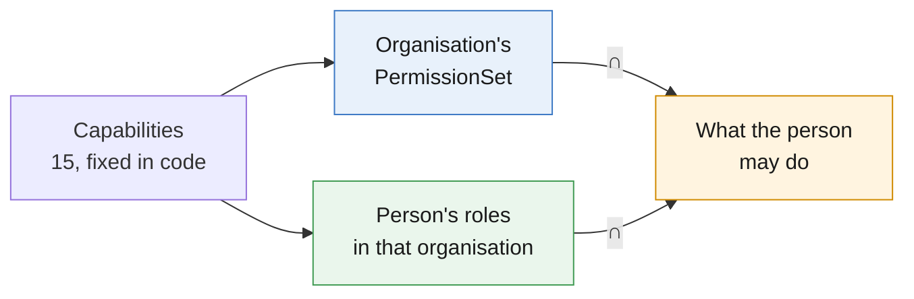
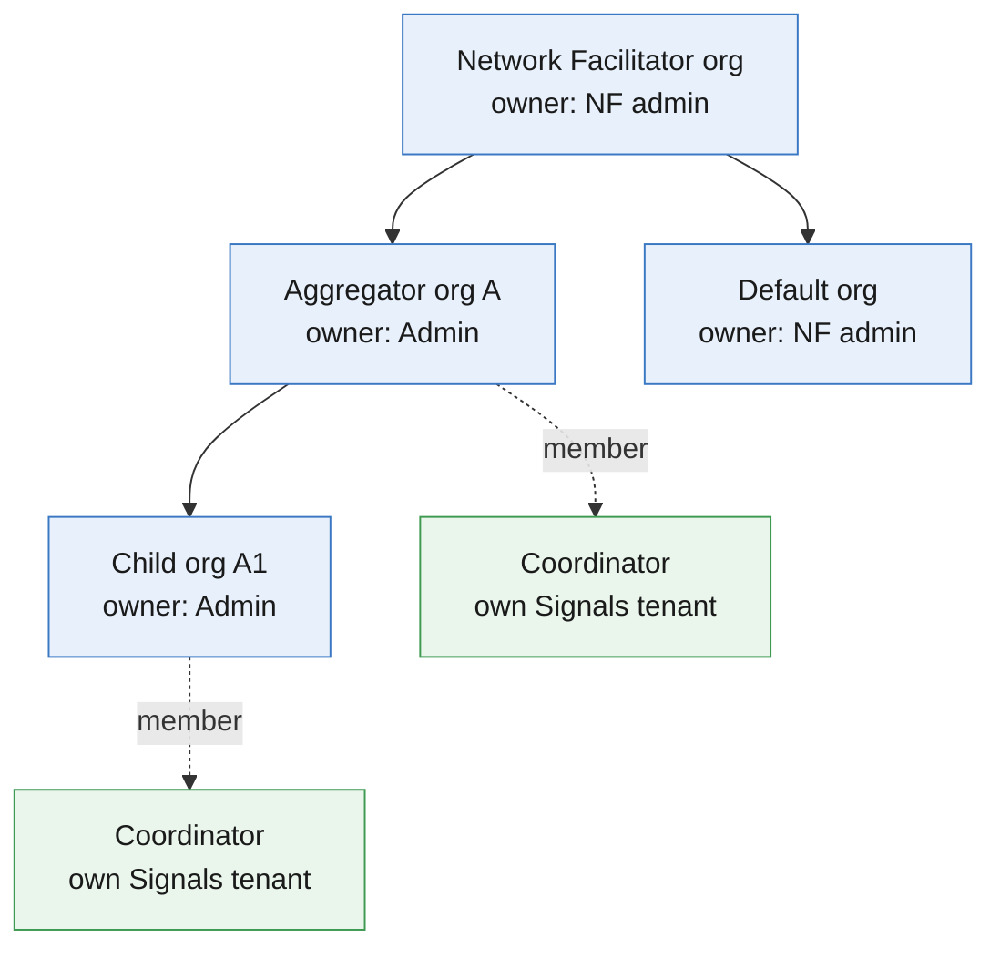
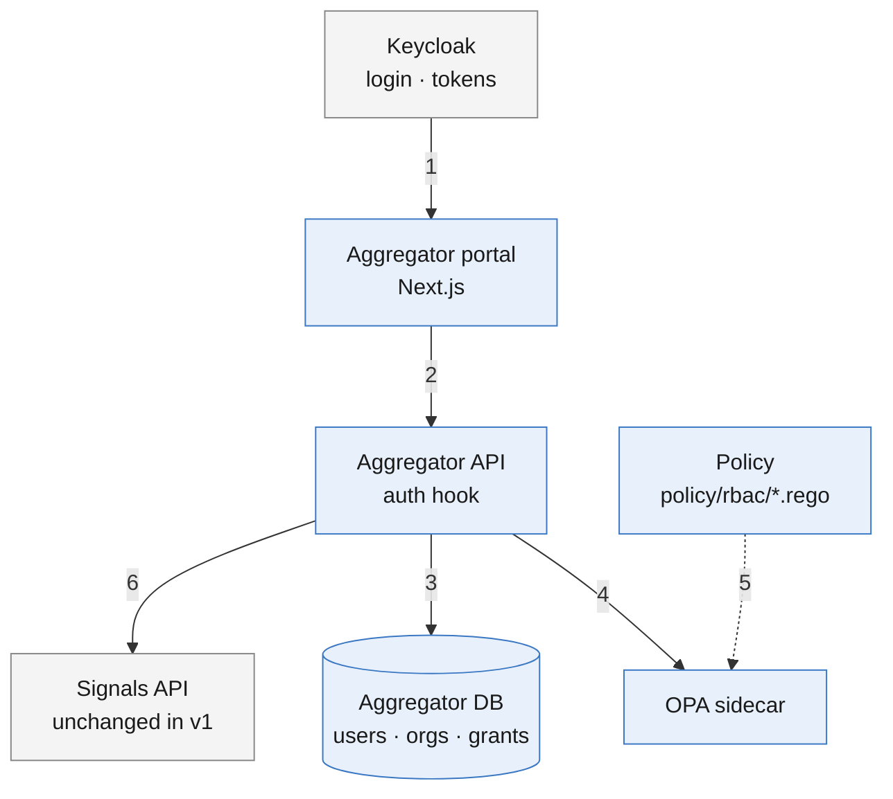
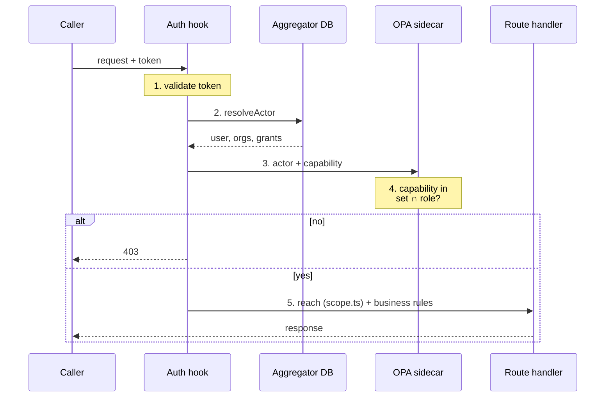
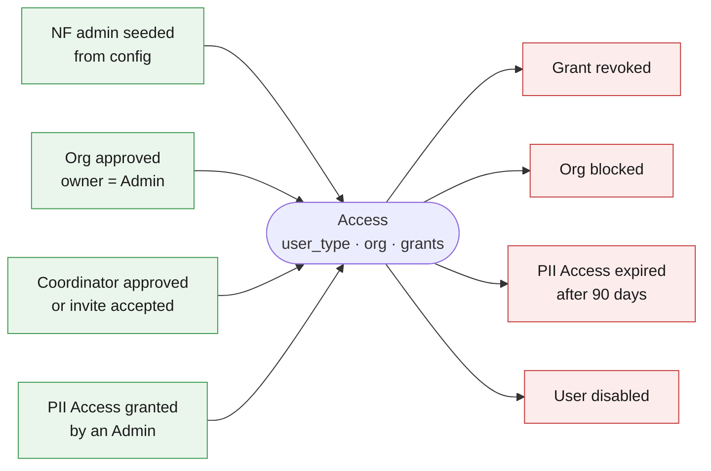

# RBAC Design v1 — aggregator-dpg

## Summary

Access control for the aggregator portal and API, built on the user and organisation model of the user-org refactor (`users`, `organisations`). The organisation's PermissionSet caps what its users may do, and an OPA sidecar makes every decision. Capabilities, sets and roles are in [rbac-permissions-and-roles.md](rbac-permissions-and-roles.md).

## Highlights

| Item      | Decision                                                                                                                                               |
| --------- | ------------------------------------------------------------------------------------------------------------------------------------------------------ |
| Scope     | aggregator-dpg only. signals-dpg is unchanged in v1.                                                                                                   |
| Who       | Admin = an organisation's `org_owner`; Coordinator = a `coordinator` user in `users.org_id`. PII Access is a per-user grant.                           |
| Reach     | Admin: the organisations they own and their coordinators, checked by Phase 5's `scope.ts` (out of reach → 404). Coordinator: their own Signals tenant. |
| Decide    | Per request: Phase 5's actor resolver reads the user; the OPA sidecar decides the capability (missing → 403). A change applies on the next request.    |
| Configure | Capabilities in code; default PermissionSets in `config/rbac.yaml`; per-organisation and per-user grants in the database                               |

---

## 1. The model

| Rule                 | Detail                                                                                                                                                                 |
| -------------------- | ---------------------------------------------------------------------------------------------------------------------------------------------------------------------- |
| Admin reach          | The organisations they own (`org_owner`) and their coordinators; their subtree once child organisations exist. Checked by `scope.ts`, not OPA (decision D3).           |
| Coordinator reach    | Their own tenant: the rows with their `user_id`, and their own Signals organisation                                                                                    |
| Subset               | An organisation's set never exceeds its parent's                                                                                                                       |
| Separation of duties | Admins grant PII Access but do not hold it; nobody grants themselves anything                                                                                          |
| Network Facilitator  | Holds every capability so it can pass them down; PII Access cannot be granted there                                                                                    |
| Default org          | Its owner (the network admin, or `DEFAULT_ORG_OWNER_EMAIL`) approves its coordinators but cannot invite into it or edit it — a rule on that organisation (decision D4) |

---

## 2. Built on the user-org refactor

| RBAC concept               | Refactor model (branches `refactor/user-org-management`, `refactor/user-org-phase-5-wip`)                              | Phase    |
| -------------------------- | ---------------------------------------------------------------------------------------------------------------------- | -------- |
| Person                     | `users` row, found from the token by `aggregator_id` (= `users.id`) or `user_identities (provider, subject)`           | 2, built |
| Organisation tree          | `organisations` with `org_type` (`network_facilitator` root, `aggregator`), `parent_id`, `max_depth`                   | 3        |
| Admin of an organisation   | `organisations.org_owner` → an `admin` user                                                                            | 2–3      |
| Coordinator's organisation | `users.org_id` (formerly flat coordinators go to the Default org)                                                      | 3        |
| Tenant data                | `user_id` + `org_id` on uploads, links, submissions, onboarding, campaigns                                             | 2–3      |
| Network admin              | The owner of the `network_facilitator` root, seeded from config; the Default org's owner can be a different admin      | 3        |
| Admin login                | Portal gate allows `aggregator_id` or the `org_owner` realm role                                                       | 5        |
| Actor resolver             | `services/auth/actor` (`StoreActorResolver`): user, organisations, `isDefault`; RBAC adds `grants` and `permissionSet` | 5        |
| Reach                      | `services/authz/scope.ts`: network admin = everything; owner = owned orgs and their coordinators; else 404             | 5        |
| Console routes             | `/v1/user/*`, `/v1/org/*`, decision services shared with the emailed links                                             | 5        |
| Membership in several orgs | `user_orgs (user_id, org_id, role)` replaces `users.org_id` later; RBAC reads it the same way                          | later    |

---

## 3. Gaps to fix first

| #   | Gap                                                                                     | Where                                                                    |
| --- | --------------------------------------------------------------------------------------- | ------------------------------------------------------------------------ |
| 1   | Every approved coordinator can export decrypted profiles                                | `routes/dashboard.ts`                                                    |
| 2   | Profile and support routes skip the approval check                                      | `aggregator-profile.ts:456`, `support.ts:231`                            |
| 3   | Registration and org sign-up accept any allowed client token, including a portal user's | `authenticateAny` in `aggregator-registrations.ts`, `aggregator-orgs.ts` |
| 4   | Approvals are emailed links with no admin identity                                      | `aggregator-approvals.ts`, `aggregator-org-approvals.ts`                 |
| 5   | `cleanup-stale` tests `sub` for a `service-account-` prefix, which a UUID never has     | `aggregator-maintenance.ts:145`                                          |
| 6   | Auth is wired per route file; a route without it is public                              | `apps/api/CLAUDE.md`                                                     |

---

## 4. Architecture

Blue: aggregator-dpg. Grey: outside it.

| Step | What happens                                                                                                            |
| ---- | ----------------------------------------------------------------------------------------------------------------------- |
| 1, 2 | The user logs in; the portal calls the API with the token                                                               |
| 3    | Phase 5's resolver reads the user, organisation and owned organisations; RBAC adds the grants                           |
| 4    | The guard sends the actor and the route's capability to OPA (deny → 403); `scope.ts` then checks reach (→ 404)          |
| 5    | OPA loads the Rego policy at start-up; the API sends the capabilities it read from `config/rbac.yaml` with each request |
| 6    | Allowed requests that need profile data call Signals as today (`x-api-key` + `x-acting-org-id`)                         |

The bundle changes only on deploy or config change. Users, organisations and grants travel in each request's input, so a revoke takes effect on the next request.

---

## 5. Checking a request

OPA input:

| Field                                                 | Source                                                                                                                            |
| ----------------------------------------------------- | --------------------------------------------------------------------------------------------------------------------------------- |
| `actor`                                               | `user_id`, `user_type`, `org_id`, owned organisations, grants (PII Access with expiry)                                            |
| `actor.orgs[].capabilities`, `actor.roleCapabilities` | The organisation's PermissionSet (its override, else the `org_type` default) and the role's capabilities, from `config/rbac.yaml` |
| `capability`                                          | Declared on the route (`config.rbac`); a route without a declaration fails at boot                                                |
| Reach                                                 | Not sent to OPA: `scope.ts` answers it after the capability check (decision D3)                                                   |

| Behaviour                           | Detail                                                                                                                                    |
| ----------------------------------- | ----------------------------------------------------------------------------------------------------------------------------------------- |
| Every route declares its capability | `config: { rbac }`: a capability, or `self` / `signed_in` / `service` / `link_token` / `public`; a CI test fails on any route without one |
| Personal data                       | Allowed only with an unexpired PII Access grant; every use is written to the audit                                                        |
| OPA down                            | Deny with `503`                                                                                                                           |
| Portal UI                           | `GET /v1/user/read/me` includes the caller's capabilities; menus and buttons follow it                                                    |
| Feature flags                       | `features.yaml` kill switches are checked before permissions                                                                              |

---

## 6. Getting and losing access

Admin and Coordinator come from `user_type` and cannot be combined in one account: one login maps to one `users` row. PII Access (and Viewer, when added) are grants on top.

---

## 7. Data and configuration

| Item                           | Holds                                                                                     | Where                                              |
| ------------------------------ | ----------------------------------------------------------------------------------------- | -------------------------------------------------- |
| Capability catalogue           | The 15 capabilities                                                                       | Code: `packages/shared-primitives/src/rbac`        |
| `config/rbac.yaml`             | Default PermissionSets per `org_type`, and the base capabilities of Admin and Coordinator | Config, network-overridable, validated at boot     |
| `organisations.permission_set` | A custom set for one organisation; NULL = the `org_type` default                          | New column                                         |
| `user_permission_grant`        | `user_id`, grant (`pii_access`), granted by, granted at, expires at                       | New table (the refactor's planned per-user grants) |
| Audit                          | Every grant change and every personal-data use                                            | New `iam_audit`; `campaign_pii_audit` stays        |
| Policy                         | Rego rules in `policy/rbac/`                                                              | Mounted into the OPA sidecar                       |

---

## 8. Rollout

| Step | Content                                                                                                                                                                 | Rollback           |
| ---- | ----------------------------------------------------------------------------------------------------------------------------------------------------------------------- | ------------------ |
| R0   | Catalogue, `config/rbac.yaml`, Rego policy, OPA sidecar, `resolveActor` hook. Decisions logged only. Test: default sets ≡ today's coordinator access.                   | Code only          |
| R1   | Declare every route, including the Phase 5 console routes; checks in the route wrappers (done)                                                                          | Code only          |
| R1.5 | Adopt Phase 5's resolver, `requireActor()` and `scope.ts`; reach leaves the policy; `checkCapability()` for field-level checks                                          | Code only          |
| R2   | `capabilities` in `user/read/me`, contact masking, identity binding, retire the emailed links; enforce per instance with `RBAC_MODE=enforce` after a clean `log` window | Flag back to `log` |
| R3   | `user_permission_grant`, PII Access, `organisations.permission_set`, the Members and PermissionSet pages                                                                | Tables unused      |

Depends on refactor Phases 3 (organisations) and 5 (`resolveActor`, admin login). At R3, existing coordinators get PII Access so nobody loses today's access; it comes up for review after 90 days.

---

## 9. After v1: signals-dpg

| Step             | Change                                                                                            |
| ---------------- | ------------------------------------------------------------------------------------------------- |
| Fix Signals gaps | Acting org bound to the caller; no `*` grant; no `role='admin'` bypass                            |
| Same policy      | A Signals OPA sidecar loads the same bundle; Signals builds the input from the aggregator's actor |
| Name the person  | The aggregator sends `x-on-behalf-of`; Signals allows client ∩ person                             |

---

## 10. Open questions

| #   | Question                                                                                                               | Default                   |
| --- | ---------------------------------------------------------------------------------------------------------------------- | ------------------------- |
| 1   | Viewer: a new `user_type`, or wait for `user_orgs` roles?                                                              | Wait for `user_orgs`      |
| 2   | Admin views across a subtree call Signals once per coordinator tenant. Cache or aggregate?                             | Cache per tenant for 60 s |
| 3   | Can ancestors' Admins grant PII Access, or only the organisation's own?                                                | Both                      |
| 4   | PII Access expiry                                                                                                      | 90 days                   |
| 5   | This design replaces the refactor's Phase 6 §5c; Phase 5's inputs are in `phase-5-rbac-handoff.md` (agreed 2026-10-07) | Agreed                    |

---

## 11. Decision record

Decided 2026-10-08 for the Phase 5 integration.

| #   | Decision                                                                              | Chosen                                                                                                          | Why                                                                                                                     |
| --- | ------------------------------------------------------------------------------------- | --------------------------------------------------------------------------------------------------------------- | ----------------------------------------------------------------------------------------------------------------------- |
| D1  | Capability for reading and searching organisations (`/v1/org/read`, `/v1/org/search`) | `org.manage`                                                                                                    | Only Admins call these routes, and every Admin holds `org.manage`; no new capability needed                             |
| D2  | Capability for repairing an owner's access (`/v1/org/access/repair`)                  | `network.administer`                                                                                            | Only the network admin may repair access; `orgs.onboard` is also held by Super Aggregators                              |
| D3  | Where reach is decided                                                                | Phase 5's `scope.ts`, outside OPA                                                                               | Out of reach answers 404 (no existence oracle); `scope.ts` also filters lists, which OPA cannot; one place for the rule |
| D4  | How the Default org is restricted                                                     | A rule on that organisation (`isDefault`): its owner approves coordinators but cannot invite into it or edit it | Keeps `org.manage` whole; the restriction belongs to the Default org, not to a role                                     |

### D3 and D4 can be changed later

Both are deliberate v1 choices. If a reason below appears, change them with the steps listed.

| #   | Revisit when                                                                                                                                                                   | Changing it means                                                                                                                                                    |
| --- | ------------------------------------------------------------------------------------------------------------------------------------------------------------------------------ | -------------------------------------------------------------------------------------------------------------------------------------------------------------------- |
| D3  | Reach needs rules OPA should own (for example per-organisation sharing, or reach that depends on grants), or Signals adopts the same policy and needs reach without `scope.ts` | Send the target's organisation chain in the OPA input again, restore the reach rules and vectors from R0 (`policy/rbac` history), and map a `no_reach` deny to 404   |
| D4  | Organisations other than the Default org need "approve but not invite or edit", or a role should manage members without editing settings                                       | Split `org.manage` into `org.members` and `org.settings` in the catalogue, `config/rbac.yaml`, the role tables and the route declarations; drop the `isDefault` rule |
