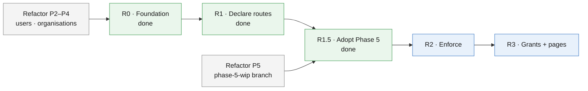
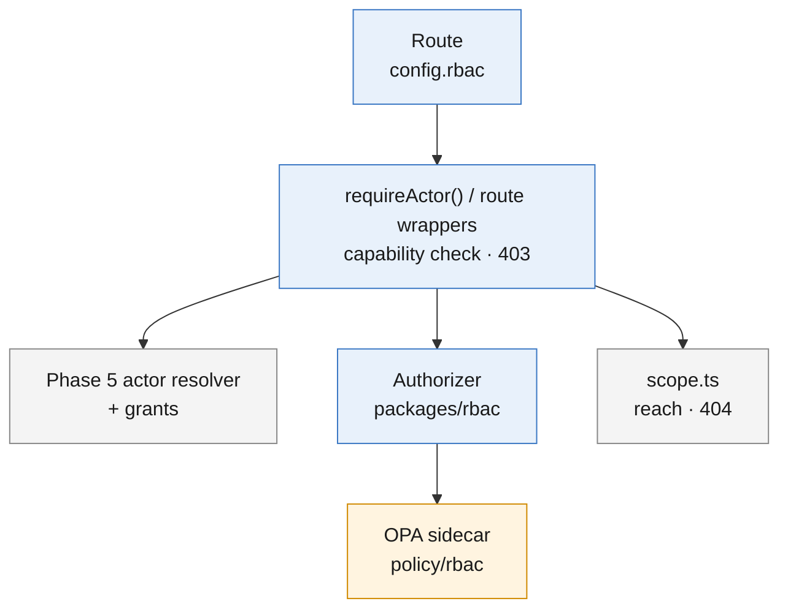

# RBAC Implementation Plan — aggregator-dpg

## Summary

The work to build [rbac-design-aggregator.md](rbac-design-aggregator.md) on branch `feat/805-rbac` (#849), based on `refactor/user-org-phase-5-wip`. Phase 5's inputs are listed in [phase-5-rbac-handoff.md](phase-5-rbac-handoff.md). Nobody loses access until an instance runs `RBAC_MODE=enforce`.

## Highlights

| Item        | Value                                                                                                          |
| ----------- | -------------------------------------------------------------------------------------------------------------- |
| Base branch | `refactor/user-org-phase-5-wip` (contains `refactor/user-org-management`); retarget the PR when Phase 5 merges |
| Done        | R0 foundation, R1 route declarations (incl. the 11 Phase 5 console routes), R1.5 adoption of Phase 5           |
| Next        | R2: capabilities for the portal, contact masking, retiring the emailed links, enforcing                        |
| Safety      | `RBAC_MODE` (`off` / `log` / `enforce`) per instance; `off` by default                                         |
| Decisions   | D1–D4 in the design's decision record; D3 and D4 can be revisited                                              |

---

## 1. Order of work

| Step                | Status | Blocked by                                                      |
| ------------------- | ------ | --------------------------------------------------------------- |
| R0 Foundation       | Done   | -                                                               |
| R1 Declare routes   | Done   | -                                                               |
| R1.5 Adopt Phase 5  | Done   | -                                                               |
| R2 Enforce          | To do  | Deployment realm gate (bluedots-automation) and the OPA sidecar |
| R3 Grants and pages | To do  | -                                                               |

---

## 2. Components

| Component                                                                                        | Path                                                                                               | Owner   |
| ------------------------------------------------------------------------------------------------ | -------------------------------------------------------------------------------------------------- | ------- |
| Capability catalogue, `rbac.yaml` schema and loader, `AuthorizerBase`, OPA and in-memory engines | `packages/rbac`                                                                                    | RBAC    |
| Policy and shared vectors                                                                        | `policy/rbac/`                                                                                     | RBAC    |
| Default sets and roles                                                                           | `config/rbac.yaml`                                                                                 | RBAC    |
| Route declarations and boot check                                                                | `apps/api/src/services/authz/route-access.ts`, `config.rbac` on every route                        | RBAC    |
| Actor resolver                                                                                   | `apps/api/src/services/auth/actor/` (`StoreActorResolver`); RBAC adds `grants` and `permissionSet` | Phase 5 |
| Admin guard                                                                                      | `requireActor()` in `services/auth/actor/require.ts`; RBAC adds the capability check               | Phase 5 |
| Reach                                                                                            | `apps/api/src/services/authz/scope.ts` (out of reach → 404)                                        | Phase 5 |
| Decision services                                                                                | `services/decisions/coordinator.ts`, `services/decisions/org.ts`                                   | Phase 5 |

---

## 3. Steps

### R0 — Foundation (done)

`packages/rbac`, `policy/rbac` with shared vectors, `config/rbac.yaml`, actor resolver and log-only guard, `RBAC_MODE` and `OPA_*` settings, `opa` service in compose, `opa check` + `opa test` in CI.

### R1 — Declare routes (done)

Every route declares `config.rbac`; the API refuses to boot without it; a snapshot test lists all routes. The check runs inside each route file's auth wrapper. Service routes require a service-account token; `self` routes an active account. `cleanup-stale` checks `preferred_username`. The 11 Phase 5 console routes are declared (Appendix A).

### R1.5 — Adopt Phase 5 (done)

| Task                                                                                                            | Where                                                                               | Done when                                       |
| --------------------------------------------------------------------------------------------------------------- | ----------------------------------------------------------------------------------- | ----------------------------------------------- |
| Use Phase 5's resolver; add `grants` and `permissionSet` to its `Actor`; delete `services/authz/actor-resolver` | `services/auth/actor/`, `services/authz/`                                           | One `ActorResolverBase` in the codebase         |
| Check the route's capability inside `requireActor()`; the older wrappers call the same check                    | `services/auth/actor/require.ts`, `services/authz/route-access.ts`                  | The actor is resolved once per request          |
| Take reach out of the policy: drop `target`, `orgChain` and the reach rules (decision D3)                       | `policy/rbac/`, `packages/rbac`, vectors                                            | `opa test` and the TS mirror pass without reach |
| `checkCapability()` for checks inside a handler (no throw)                                                      | `services/authz/`                                                                   | Used by contact masking and org rename          |
| Org rename needs `network.administer`; Default org refuses invite and edit (decision D4)                        | Already enforced by Phase 5 (`v1-org.ts`, `v1-user.ts`), independent of `RBAC_MODE` | Phase 5 tests; RBAC-enforced console tests      |
| Catalogue: `org.manage` covers inviting and approving coordinators; `orgs.onboard` covers organisations only    | `docs/rbac/rbac-permissions-and-roles.md`                                           | Done in docs                                    |

### R2 — Enforce

| Task                                                                                                                                        | Where                                                                  | Done when                                        |
| ------------------------------------------------------------------------------------------------------------------------------------------- | ---------------------------------------------------------------------- | ------------------------------------------------ |
| `capabilities` in `GET /v1/user/read/me`                                                                                                    | `routes/v1-user.ts`                                                    | The portal receives the list                     |
| Mask contacts in `user/search` and `user/read` unless `contact.unmask`; audit each unmasked read                                            | `routes/v1-user.ts`                                                    | Masked for a holder without the capability       |
| Coordinator routes require the recorded login (`user_identities`), once the deployment realm makes the attributes admin-only (handoff H-11) | resolver                                                               | A token with a forged `aggregator_id` is refused |
| Retire the emailed decision pages and `POST /admin/v1/invites` (H-7, H-8)                                                                   | `aggregator-approvals.ts`, `aggregator-org-approvals.ts`, `invites.ts` | Their `link_token` declarations are gone         |
| Worker re-checks the requester before PII jobs                                                                                              | `apps/worker` campaign and bulk jobs                                   | A revoked user's job fails with an audit row     |
| Portal hides what the user cannot use                                                                                                       | `apps/web`                                                             | Menus and buttons follow `capabilities`          |
| Resolve the coordinator export/PII gap (open item 1), then flip instances to `enforce`                                                      | Instance config                                                        | No unexplained would-denies for one release      |

### R3 — Grants and pages

| Task                                                                                      | Where                                               | Done when                                       |
| ----------------------------------------------------------------------------------------- | --------------------------------------------------- | ----------------------------------------------- |
| Migration: `organisations.permission_set`, `user_permission_grant`, `iam_audit`           | `apps/api/drizzle/migrations`, `packages/db-schema` | Next free number at merge                       |
| Grant and set APIs with the subset, separation-of-duties and owner rules                  | API                                                 | Each rule has a failing-then-passing test       |
| Revocation removes the Keycloak role and calls `logoutSessions` (H-10, H-12)              | grant service                                       | A revoked owner cannot sign in                  |
| PII Access expiry (90 days) and backfill for existing coordinators                        | `apps/worker`, migration or tool                    | Nobody loses today's access                     |
| With per-organisation sets, check the target organisation's set after `scope.ts` picks it | guard                                               | Test with two owned orgs holding different sets |
| Members and PermissionSet pages                                                           | `apps/web`                                          | An Admin grants and revokes PII Access          |

---

## 4. Tests

| Level                         | Covers                                                                                      |
| ----------------------------- | ------------------------------------------------------------------------------------------- |
| Rego (`opa test`) + TS mirror | Role × capability × set, grants and expiry, not-grantable, no PII at the root               |
| Unit (Vitest, ≥ 70%)          | `packages/rbac`, guard, route access, `checkCapability()`                                   |
| Route snapshot                | Every route's declaration; any change shows in review                                       |
| Phase 5 tests                 | Reach (`scope.ts`) and the console routes                                                   |
| E2E (`aggregator-e2e` skill)  | Admin login → coordinator approval → export denied without PII Access → allowed after grant |

---

## 5. Work outside this repo

| Repo                  | Change                                                                                      | Step         |
| --------------------- | ------------------------------------------------------------------------------------------- | ------------ |
| `bluedots-automation` | OPA sidecar in the API pod, `OPA_URL`                                                       | before `log` |
| `bluedots-automation` | Portal gate for admins and admin-only attributes in the deployment realm (handoff §1, H-11) | R2           |

---

## 6. Open items

| #   | Item                                                                                                  | Recommendation                                                                                                |
| --- | ----------------------------------------------------------------------------------------------------- | ------------------------------------------------------------------------------------------------------------- |
| 1   | Today a coordinator can export lists and decrypted profiles; the default Coordinator role has neither | Ship `profiles.export` in the Coordinator config for existing instances; backfill PII Access before enforcing |
| 2   | Admin views across many coordinators call Signals once per coordinator tenant                         | Measure at R2; cache per tenant if slow                                                                       |
| 3   | `refactor/user-org-phase-5-wip` may be rebased before it merges                                       | Rebase on each change; ask its owner to announce history rewrites                                             |

---

## Appendix A. Route declarations

| Routes                                                                                                                       | Declaration                                                                               |
| ---------------------------------------------------------------------------------------------------------------------------- | ----------------------------------------------------------------------------------------- |
| `health.ts`, `aggregator-config.ts`, `public-registration-links.ts`, `public-lookup.ts`                                      | `public`                                                                                  |
| `aggregator-registrations.ts` (create), `aggregator-orgs.ts` (create, list), `aggregator-maintenance.ts`, `campaign-dump.ts` | `service`                                                                                 |
| `aggregator-approvals.ts`, `aggregator-org-approvals.ts`, `invites.ts`                                                       | `link_token` until retired in R2                                                          |
| `aggregator-profile.ts`                                                                                                      | `self`                                                                                    |
| `support.ts`, `GET /v1/user/read/me`                                                                                         | `signed_in`                                                                               |
| `registration-links.ts`                                                                                                      | reads `profiles.view`; writes `profiles.onboard`                                          |
| `bulk-uploads.ts`                                                                                                            | list and status `profiles.view`; template, create, start, `errors.csv` `profiles.onboard` |
| `onboarding.ts`, `campaign-jobs.ts`                                                                                          | `profiles.view`                                                                           |
| `dashboard.ts`                                                                                                               | read `profiles.view`; export `profiles.export`; export profiles `profiles.view_pii`       |
| `campaign-export.ts`                                                                                                         | `profiles.view_pii`                                                                       |
| `campaign-email.ts`, `campaign-voice.ts`                                                                                     | `campaigns.run`                                                                           |
| `/v1/user/read/:id`, `/v1/user/search`, `/v1/user/create`, `/v1/user/decision/:id`, `/v1/user/metadata/update/:id`           | `org.manage`                                                                              |
| `/v1/org/read/:id`, `/v1/org/search`, `/v1/org/metadata/update/:id`                                                          | `org.manage` (decision D1; rename also needs `network.administer`)                        |
| `/v1/org/decision/:id`                                                                                                       | `orgs.onboard`                                                                            |
| `/v1/org/access/repair/:id`                                                                                                  | `network.administer` (decision D2)                                                        |
