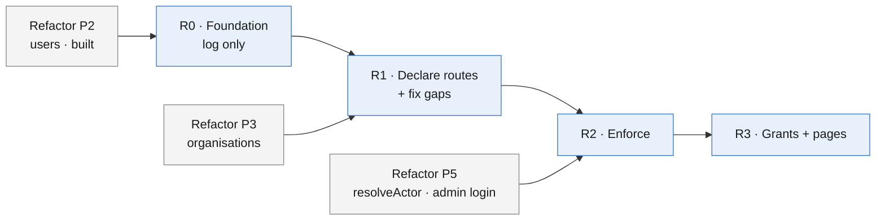
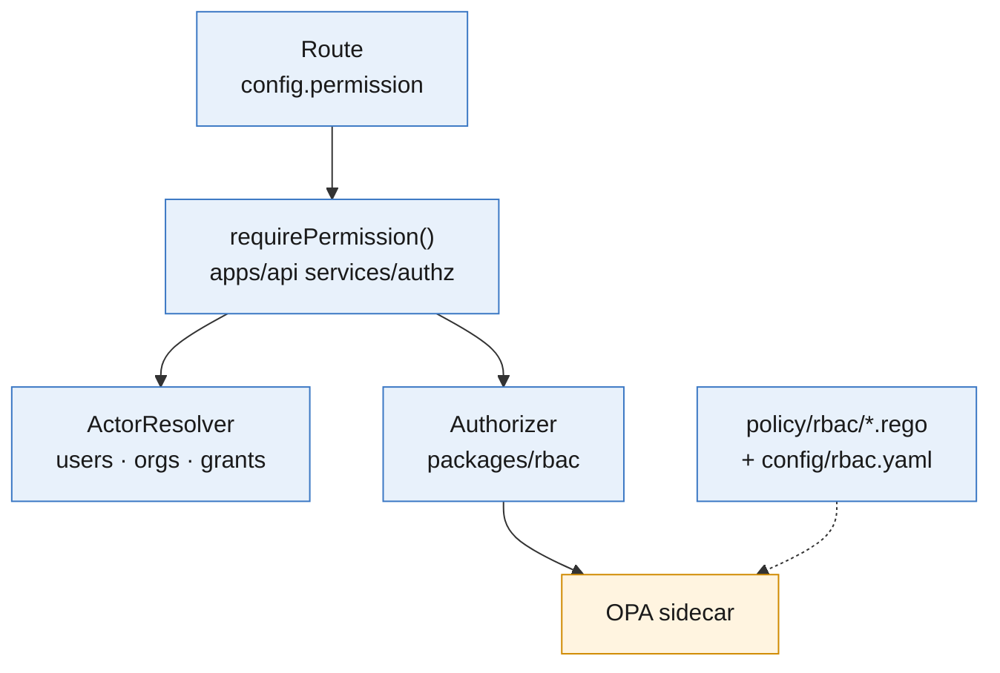

# RBAC Implementation Plan — aggregator-dpg

## Summary

The work to build [rbac-design-aggregator.md](rbac-design-aggregator.md) on branch `feat/805-rbac`, which is based on `refactor/user-org-management`. It is split into four steps, R0–R3, each shippable on its own; nobody loses access until R2 is switched on per instance.

## Highlights

| Item        | Value                                                                                                                  |
| ----------- | ---------------------------------------------------------------------------------------------------------------------- |
| New package | `packages/rbac`: capability catalogue, `rbac.yaml` schema, `AuthorizerBase` and its OPA implementation                 |
| New runtime | OPA sidecar next to the API, loading `policy/rbac/`; the API sends the capabilities from `config/rbac.yaml`            |
| API change  | A `requirePermission()` guard inside each route file's existing auth wrapper; every route declares `config.permission` |
| Safety      | `RBAC_MODE` (`off` / `log` / `enforce`) per instance; `off` by default                                                 |
| Depends on  | Refactor Phase 3 (organisations) before R1; Phase 5 (`resolveActor`, admin login) before R2                            |

---

## 1. Order of work

| Step                        | Can start | Blocked by                                              |
| --------------------------- | --------- | ------------------------------------------------------- |
| R0 Foundation               | Now       | -                                                       |
| R1 Declare routes, fix gaps | After R0  | Phase 3: the organisation tree for subtree checks       |
| R2 Enforce                  | After R1  | Phase 5: owners and the NF admin must be able to log in |
| R3 Grants and pages         | After R2  | -                                                       |

---

## 2. Components

| Component      | Path                                                                           | Contents                                                                                                                                                                 |
| -------------- | ------------------------------------------------------------------------------ | ------------------------------------------------------------------------------------------------------------------------------------------------------------------------ |
| Catalogue      | `packages/rbac/src/catalogue.ts`                                               | `CapabilitySchema` (Zod enum of the 15 IDs), the roles, `isGrantable()`                                                                                                  |
| Config schema  | `packages/rbac/src/config.schema.ts`                                           | Zod schema for `config/rbac.yaml`; unknown capability → `ConfigError` at boot                                                                                            |
| Authorizer     | `packages/rbac/src/interface.ts`, `src/opa/`, `src/in-memory/`, `src/testing/` | `AuthorizerBase.decide(input): Promise<Result<Decision, BaseError>>`; OPA over HTTP; an in-memory fake for tests (package `_template` layout, `./interface` subpath)     |
| Policy         | `policy/rbac/rbac.rego`, `policy/rbac/rbac_test.rego`                          | Set ∩ role, reach (subtree or own tenant), grant expiry, not-grantable capabilities, deny by default                                                                     |
| Config         | `config/rbac.yaml`                                                             | Default sets per `org_type`; base capabilities of Admin and Coordinator                                                                                                  |
| Actor resolver | `apps/api/src/services/authz/actor-resolver/`                                  | `ActorResolverBase` + Postgres implementation: user, organisation, owned organisations, ancestors, grants. Replaced by Phase 5 `resolveActor` behind the same interface. |
| Guard          | `apps/api/src/services/authz/guard.ts`                                         | `requirePermission(req, capability, target?)`: resolve → decide → log or deny                                                                                            |
| Route check    | `apps/api/src/services/authz/route-registry.ts`                                | `onRoute` hook that fails boot when a route has no declaration                                                                                                           |

---

## 3. Steps

### R0 — Foundation (log only)

| Task                                                                                                                       | Where                                        | Done when                                                                                    |
| -------------------------------------------------------------------------------------------------------------------------- | -------------------------------------------- | -------------------------------------------------------------------------------------------- |
| Create `packages/rbac` from `packages/_template`                                                                           | `packages/rbac`                              | Builds; dep-cruiser passes                                                                   |
| Catalogue, roles and `rbac.yaml` schema                                                                                    | `packages/rbac/src`                          | Unit tests cover every capability and an invalid config                                      |
| `config/rbac.yaml` with the default sets                                                                                   | `config/rbac.yaml`                           | Loaded once at boot by the API (`loadRbacConfig`); invalid config stops boot                 |
| Rego policy and its tests                                                                                                  | `policy/rbac/`                               | `opa test policy/rbac` passes                                                                |
| OPA authorizer and in-memory fake                                                                                          | `packages/rbac/src/opa`, `src/in-memory`     | Timeout and OPA-down return a deny `Result`, never throw                                     |
| Actor resolver against today's schema (`users`, `aggregator_orgs.owner_user_id`, `users.parent_org_id`, `user_identities`) | `apps/api/src/services/authz/actor-resolver` | One indexed query per request; tests for coordinator, admin, unknown user                    |
| Guard in log-only mode                                                                                                     | `apps/api/src/services/authz/guard.ts`       | A would-deny is logged at `warn` with route, capability and `user_id`; the request continues |
| `opa` service in local compose; `OPA_URL` env                                                                              | `docker-compose.yml`, `infra/env.template`   | `docker compose up` starts OPA with the bundle mounted                                       |
| CI job: `opa check` + `opa test`                                                                                           | `.github/workflows/ci.yml`                   | Required check passes                                                                        |
| Equivalence test: the default Coordinator set allows every route a coordinator can call today                              | `apps/api/src/services/authz/__tests__`      | Passes, or lists the routes to resolve (open item 1)                                         |

### R1 — Declare routes, fix gaps

| Task                                                            | Where                                                                            | Done when                                                                 |
| --------------------------------------------------------------- | -------------------------------------------------------------------------------- | ------------------------------------------------------------------------- |
| Declare `config.permission` on every route (Appendix A)         | `apps/api/src/routes/*.ts`                                                       | Boot check and CI route test pass                                         |
| Call `requirePermission()` inside each file's existing wrapper  | `apps/api/src/routes/*.ts`                                                       | One line per wrapper; handlers unchanged                                  |
| Switch the resolver to `organisations.parent_id` and `org_type` | actor resolver                                                                   | Subtree tests: five levels, flat, siblings, removed parent (#805)         |
| Profile and support use an approved, active user                | `aggregator-profile.ts`, `support.ts`                                            | A pending user gets `403`                                                 |
| Service-only routes check `preferred_username`                  | `aggregator-registrations.ts`, `aggregator-orgs.ts`, `aggregator-maintenance.ts` | A portal user's token gets `403`; `cleanup-stale` works for the scheduler |

### R2 — Enforce

| Task                                                                                      | Where                                                                  | Done when                                                    |
| ----------------------------------------------------------------------------------------- | ---------------------------------------------------------------------- | ------------------------------------------------------------ |
| `RBAC_MODE` per instance: `off` → `log` → `enforce`                                       | Instance env                                                           | `enforce` returns `403 FORBIDDEN` with `fields.permission`   |
| Approval and invite routes move from link tokens to login + `orgs.onboard` / `org.manage` | `aggregator-approvals.ts`, `aggregator-org-approvals.ts`, `invites.ts` | Needs Phase 5 admin login; links open a login-protected page |
| Worker re-checks the requester before running PII jobs                                    | `apps/worker` campaign and bulk jobs                                   | A job of a revoked user fails with an audit row              |
| `capabilities` in the caller's profile response                                           | `aggregator-profile.ts` (later `/v1/user/read/me`)                     | Portal receives the list                                     |
| Portal hides what the user cannot use                                                     | `apps/web` `AuthProvider`, `Sidebar.tsx`, dashboard actions            | Menus and buttons follow `capabilities`                      |
| Flip to `enforce` per instance after a clean log window                                   | Instance config                                                        | No unexplained would-deny lines for one release              |

### R3 — Grants and pages

| Task                                                                            | Where                                               | Done when                                                                        |
| ------------------------------------------------------------------------------- | --------------------------------------------------- | -------------------------------------------------------------------------------- |
| Migration: `organisations.permission_set`, `user_permission_grant`, `iam_audit` | `apps/api/drizzle/migrations`, `packages/db-schema` | Next number after the refactor train; hand-written SQL per `apps/api/CLAUDE.md`  |
| Grant and set APIs with the subset, separation-of-duties and owner rules        | `apps/api/src/routes/iam.ts`                        | Each rule has a failing-then-passing test                                        |
| PII Access expiry job (90 days)                                                 | `apps/worker` repeatable job                        | Expired grants stop working on the next request                                  |
| Backfill: existing coordinators get PII Access                                  | Migration or operator script                        | Nobody loses today's access                                                      |
| Members and PermissionSet pages                                                 | `apps/web`                                          | An Admin grants and revokes PII Access; an owner applies a custom set to a child |

---

## 4. Tests

| Level                        | Covers                                                                                      |
| ---------------------------- | ------------------------------------------------------------------------------------------- |
| Rego (`opa test`)            | Every role × capability, subset, reach, expiry, not-grantable, Network Facilitator PII rule |
| Unit (Vitest, ≥ 70%)         | `packages/rbac`, resolver, guard, route registry; OPA down; invalid config                  |
| Integration                  | Resolver against Postgres: five-level tree, flat tree, siblings, removed parent             |
| Route test                   | Every registered route has a declaration                                                    |
| E2E (`aggregator-e2e` skill) | Login → dashboard → export denied without PII Access → allowed after grant                  |

---

## 5. Work outside this repo

| Repo                  | Change                                                          | Step |
| --------------------- | --------------------------------------------------------------- | ---- |
| `bluedots-automation` | OPA sidecar in the API pod (Helm), bundle mount, `OPA_URL`      | R0   |
| `bluedots-automation` | Portal login gate for admins (realm), as refactor Phase 5 plans | R2   |

---

## 6. Open items

| #   | Item                                                                                                  | Recommendation                                                                                                    |
| --- | ----------------------------------------------------------------------------------------------------- | ----------------------------------------------------------------------------------------------------------------- |
| 1   | Today a coordinator can export lists and decrypted profiles; the default Coordinator role has neither | Put `profiles.export` in the shipped Coordinator config for existing instances; give PII Access by backfill at R3 |
| 2   | Admin dashboards across a subtree call Signals once per coordinator tenant                            | Measure at R2; cache per tenant if slow                                                                           |
| 3   | Migration number for R3                                                                               | Take the next free number when R3 is ready to merge                                                               |

---

## Appendix A. Route declarations

| Route file                                                                                                                   | Declaration                                                                               |
| ---------------------------------------------------------------------------------------------------------------------------- | ----------------------------------------------------------------------------------------- |
| `health.ts`, `aggregator-config.ts`, `public-registration-links.ts`, `public-lookup.ts`                                      | `public`                                                                                  |
| `aggregator-registrations.ts` (create), `aggregator-orgs.ts` (create, list), `aggregator-maintenance.ts`, `campaign-dump.ts` | `service`                                                                                 |
| `aggregator-approvals.ts`, `aggregator-org-approvals.ts`                                                                     | `link_token` until R2, then `orgs.onboard`                                                |
| `invites.ts`                                                                                                                 | `link_token` until R2, then `org.manage`                                                  |
| `aggregator-profile.ts`                                                                                                      | `self`                                                                                    |
| `support.ts`                                                                                                                 | `signed_in`                                                                               |
| `registration-links.ts`                                                                                                      | reads `profiles.view`; writes `profiles.onboard`                                          |
| `bulk-uploads.ts`                                                                                                            | list and status `profiles.view`; template, create, start, `errors.csv` `profiles.onboard` |
| `onboarding.ts`, `campaign-jobs.ts`                                                                                          | `profiles.view`                                                                           |
| `dashboard.ts`                                                                                                               | read `profiles.view`; export `profiles.export`; export profiles `profiles.view_pii`       |
| `campaign-export.ts`                                                                                                         | `profiles.view_pii`                                                                       |
| `campaign-email.ts`, `campaign-voice.ts`, web `POST /api/dashboard/actions`                                                  | `campaigns.run`                                                                           |
