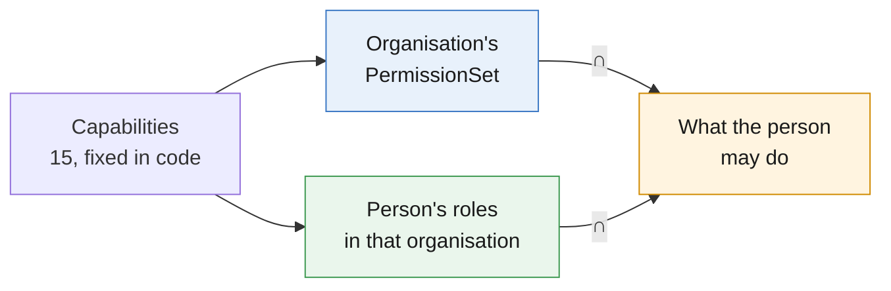
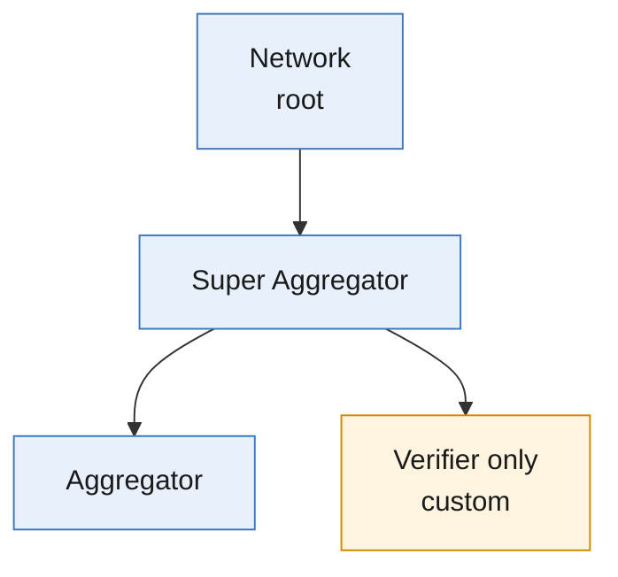
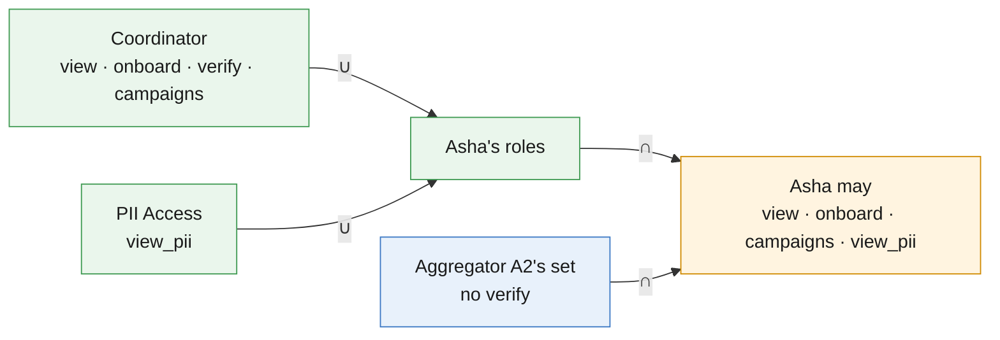

# RBAC Catalogue — Capabilities, PermissionSets & Roles

## Summary

What each organisation and person may do, and how the two combine. [rbac-design-aggregator.md](rbac-design-aggregator.md) covers enforcement in aggregator-dpg.

## Highlights

| Item           | Value                                                                        |
| -------------- | ---------------------------------------------------------------------------- |
| Capabilities   | 15, fixed in code                                                            |
| PermissionSets | 3 defaults for organisations; parents compose custom sets for their children |
| Roles          | Admin and Coordinator (user types), plus PII Access as a grant               |
| Personal data  | Only with PII Access: expires after 90 days, audited                         |

### Terms

| Term          | Meaning                                                                                           |
| ------------- | ------------------------------------------------------------------------------------------------- |
| Profile       | A seeker's or provider's record on the network                                                    |
| Organisation  | A node in the network tree: the Network Facilitator at the root, aggregator organisations beneath |
| PermissionSet | The capabilities an organisation holds                                                            |
| Role          | What a person may do inside their organisation                                                    |

---

## Access at a glance

Access applies to the person's organisation and every organisation beneath it.

---

## 1. Capabilities

| ID                       | Lets the holder                                                                                   | Note                         |
| ------------------------ | ------------------------------------------------------------------------------------------------- | ---------------------------- |
| `profiles.view`          | See masked profiles, dashboards, metrics                                                          | -                            |
| `profiles.export`        | Download masked lists                                                                             | -                            |
| `profiles.view_pii`      | See and export decrypted details                                                                  | Audited                      |
| `profiles.onboard`       | Links, bulk uploads, forms; edit and pause profiles                                               | Every organisation holds it  |
| `profiles.verify`        | Mark profiles verified                                                                            | -                            |
| `profiles.retire`        | Retire a profile                                                                                  | Irreversible                 |
| `profiles.move`          | Move profiles to another aggregator                                                               | Super Aggregator status only |
| `profiles.act_on_behalf` | Connect or apply for a profile's owner                                                            | Service clients only today   |
| `campaigns.run`          | Email and voice campaigns                                                                         | Audited                      |
| `orgs.onboard`           | Invite and approve child organisations (not coordinators); compose their sets                     | -                            |
| `orgs.block`             | Suspend or remove a child organisation                                                            | Not grantable yet            |
| `org.manage`             | Organisation profile; members: invite and approve coordinators; roles                             | -                            |
| `contact.unmask`         | See the full email and phone of users in reach                                                    | Audited                      |
| `agreement.manage`       | Create and configure agreements (terms, privacy, consent) and link them to organisations or users | -                            |
| `network.administer`     | Network config, service clients, audit, bans                                                      | Network Facilitator only     |

---

## 2. PermissionSets (organisations)

| Capability               | Network | Super Aggregator | Aggregator |
| ------------------------ | ------- | ---------------- | ---------- |
| `profiles.view`          | ✓       | ✓                | ✓          |
| `profiles.export`        | ✓       | ✓                | ✓          |
| `profiles.view_pii`      | ✓       | ✓                | ✓          |
| `profiles.onboard`       | ✓       | ✓                | ✓          |
| `profiles.verify`        | ✓       | ✓                | -          |
| `profiles.retire`        | ✓       | ✓                | ✓          |
| `profiles.move`          | ✓       | ✓                | -          |
| `profiles.act_on_behalf` | ✓       | -                | -          |
| `campaigns.run`          | ✓       | ✓                | ✓          |
| `orgs.onboard`           | ✓       | ✓                | -          |
| `orgs.block`             | ✓       | -                | -          |
| `org.manage`             | ✓       | ✓                | ✓          |
| `contact.unmask`         | ✓       | ✓                | ✓          |
| `agreement.manage`       | ✓       | -                | -          |
| `network.administer`     | ✓       | -                | -          |

A parent picks a child's set at invite or approval. Each set sits inside its parent's:

| Set                            | Compared with its parent                                                                 |
| ------------------------------ | ---------------------------------------------------------------------------------------- |
| Network                        | Every capability (the Network Facilitator, root of the tree)                             |
| Super Aggregator               | Without `network.administer`, `agreement.manage`, `profiles.act_on_behalf`, `orgs.block` |
| Aggregator                     | Also without `profiles.verify`, `profiles.move`, `orgs.onboard`                          |
| Verifier only (custom example) | Only `profiles.view`, `profiles.onboard`, `profiles.verify`                              |

Any organisation holding `orgs.onboard` can compose custom sets for its children from its own capabilities.

---

## 3. Roles (people)

| Role        | Held as                                        | Capabilities, within the organisation's set                             | Reach                                                       |
| ----------- | ---------------------------------------------- | ----------------------------------------------------------------------- | ----------------------------------------------------------- |
| Admin       | `user_type = admin`, owner of the organisation | All except `profiles.view_pii` and `profiles.act_on_behalf`             | The organisation and its subtree                            |
| Coordinator | `user_type = coordinator` in the organisation  | `profiles.view`, `profiles.onboard`, `profiles.verify`, `campaigns.run` | Own tenant: profiles, links, uploads and campaigns they own |
| PII Access  | A grant added by an Admin                      | `profiles.view_pii`                                                     | Same as the holder's role; expires after 90 days            |
| Viewer      | Planned, with multi-organisation membership    | `profiles.view`                                                         | The organisation and its subtree                            |

Grants add to a role, then the organisation's set caps them. Example: Asha is Coordinator + PII Access at Aggregator A2. A2's set has no `profiles.verify`, so she cannot verify:

---

## 4. Rules

| Rule                  | Detail                                                                                                                                |
| --------------------- | ------------------------------------------------------------------------------------------------------------------------------------- |
| Subset                | A child's set never exceeds its parent's; checked at grant time                                                                       |
| Onboarding            | `profiles.onboard` is in every set and cannot be removed                                                                              |
| Separation of duties  | Admins grant PII Access but don't hold it; nobody edits their own roles                                                               |
| Network Facilitator   | Holds every capability so it can pass them down, but PII Access cannot be granted there                                               |
| Owner                 | Every organisation has exactly one owner; ownership is transferred, never removed                                                     |
| Default org           | Its owner approves its coordinators but cannot invite into it or edit it (a rule on that organisation; see the design\'s decision D4) |
| Audit                 | Every grant, change, revoke and personal-data use                                                                                     |
| Seekers and providers | Own data only, through fixed self-service rules (Appendix B)                                                                          |
| Changes               | Capabilities change only in code. IDs are never renamed: add a new one, retire the old.                                               |

---

## Appendix A. Capability → routes

| Capability               | signals-dpg                                                                                                                   | aggregator-dpg                                                                                                                                                                                                                                                                                    |
| ------------------------ | ----------------------------------------------------------------------------------------------------------------------------- | ------------------------------------------------------------------------------------------------------------------------------------------------------------------------------------------------------------------------------------------------------------------------------------------------- |
| `profiles.view`          | `GET /admin/participant`, `GET /aggregator/dashboard`                                                                         | `GET /v1/dashboard`, `/v1/onboarding/*`, `GET /v1/links*`, `GET /v1/bulk-uploads*`, `GET /v1/campaign/*`                                                                                                                                                                                          |
| `profiles.export`        | `GET /aggregator/dashboard/export`                                                                                            | `GET /v1/dashboard/export`                                                                                                                                                                                                                                                                        |
| `profiles.view_pii`      | `POST /admin/participant/decrypt`                                                                                             | `POST /v1/dashboard/export/profiles`, `POST /v1/campaign/export`                                                                                                                                                                                                                                  |
| `profiles.onboard`       | `POST /admin/participant`, `POST /item/create` (`created_by`), `PATCH /item/:itemId`, `POST /item/lifecycle` (pause, unpause) | `/v1/links*` writes, `/v1/bulk-uploads*` writes, including template and `errors.csv`                                                                                                                                                                                                              |
| `profiles.verify`        | No route yet                                                                                                                  | No route yet                                                                                                                                                                                                                                                                                      |
| `profiles.retire`        | `POST /item/lifecycle` (retire, on a profile the caller does not own)                                                         | -                                                                                                                                                                                                                                                                                                 |
| `profiles.move`          | No route yet                                                                                                                  | No route yet                                                                                                                                                                                                                                                                                      |
| `profiles.act_on_behalf` | `POST /action/perform*` with `acting_as_user_id`                                                                              | -                                                                                                                                                                                                                                                                                                 |
| `campaigns.run`          | -                                                                                                                             | `POST /v1/campaign/email`, `POST /v1/campaign/voice`, `POST /api/dashboard/actions`                                                                                                                                                                                                               |
| `orgs.onboard`           | -                                                                                                                             | `/admin/v1/orgs/*` (emailed links until retired), `POST /v1/org/decision/:id`, PermissionSet editor                                                                                                                                                                                               |
| `orgs.block`             | No route yet                                                                                                                  | No route yet                                                                                                                                                                                                                                                                                      |
| `org.manage`             | -                                                                                                                             | `PATCH /v1/aggregators/profile/me`; `/v1/user/read/:id`, `/v1/user/search`, `/v1/user/create`, `/v1/user/decision/:id`, `/v1/user/metadata/update/:id`; `/v1/org/read/:id`, `/v1/org/search`, `/v1/org/metadata/update/:id`; `/admin/v1/aggregator-registrations/*` (emailed links until retired) |
| `contact.unmask`         | -                                                                                                                             | `/v1/user/*` reads (refactor Phase 5)                                                                                                                                                                                                                                                             |
| `agreement.manage`       | -                                                                                                                             | Agreement APIs (refactor Phase 6)                                                                                                                                                                                                                                                                 |
| `network.administer`     | `POST /network/refetch_schemas`, audit log                                                                                    | `POST /v1/org/access/repair/:id`; renaming an organisation; service-client and network settings pages                                                                                                                                                                                             |

## Appendix B. Access that is not a capability

| Access                                        | Operations                                                                                                                                                                                                                                                                                                                                                                     |
| --------------------------------------------- | ------------------------------------------------------------------------------------------------------------------------------------------------------------------------------------------------------------------------------------------------------------------------------------------------------------------------------------------------------------------------------ |
| Public (rate limits, Turnstile, signed links) | signals: `/health/*`, `/auth/config`, `/auth/session*`, `/auth/signup`, `/auth/u18-precheck`, `/network/schema*`, `/network/item/fetch`, `/network/item/markers`, `/network/item/discover`, `/consent/status-by-identifier`, `/consent/u18/signup/guardian*`. aggregator: `/health/*`, `/v1/aggregator-config`, `/v1/participant-consent`, `/public/v1/aggregators/:orgSlug/*` |
| Any signed-in person                          | Own account (`GET /auth/me`), support requests                                                                                                                                                                                                                                                                                                                                 |
| Seeker or provider, own data only             | `/user/domains`, `/consent/*`, `/item/*` on own profiles, `/action/*`, `/event/*`, `/match-score/calculate`                                                                                                                                                                                                                                                                    |

## Appendix C. Service clients

Service clients are machine identities. People never hold these.

| Client                            | Allowed                                                                                                                                          | Condition                                                          |
| --------------------------------- | ------------------------------------------------------------------------------------------------------------------------------------------------ | ------------------------------------------------------------------ |
| `aggregator-dpg` (API and worker) | `profiles.view`, `profiles.export`, `profiles.view_pii`, `profiles.onboard`; syncing organisations into Signals; cleaning up stale registrations | Profile calls carry the acting person; effective = client ∩ person |
| `aggregator-bff`                  | Registration and organisation sign-up forms, organisation list                                                                                   | No profile data                                                    |
| `voice-dpg` (Raya)                | `profiles.act_on_behalf`, own-data access                                                                                                        | Only for the OTP-verified caller                                   |
| `campaign-manager`                | `profiles.view`, `profiles.view_pii`, `campaigns.run`, network-wide non-PII dump                                                                 | Intersects with the operator's access, except the dump             |
| Peer instances                    | Federated reads and cross-instance actions                                                                                                       | Signed peer requests                                               |
