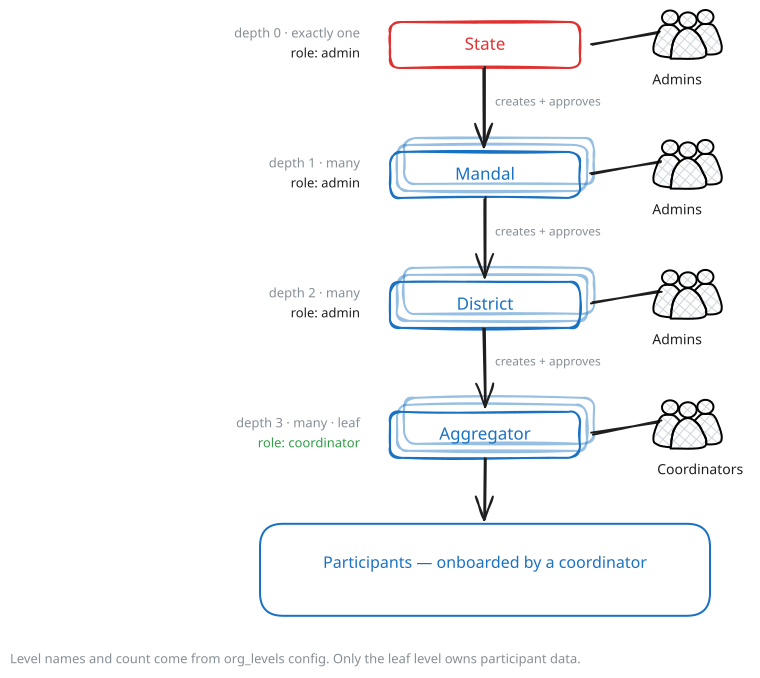
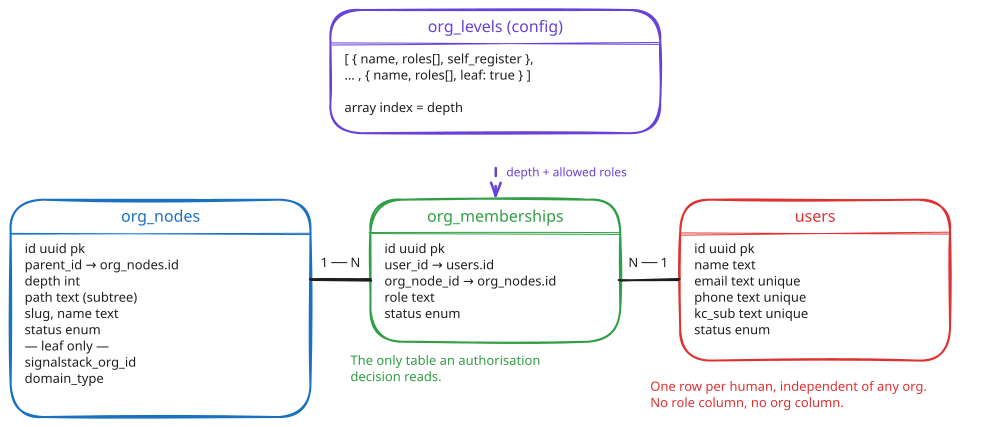
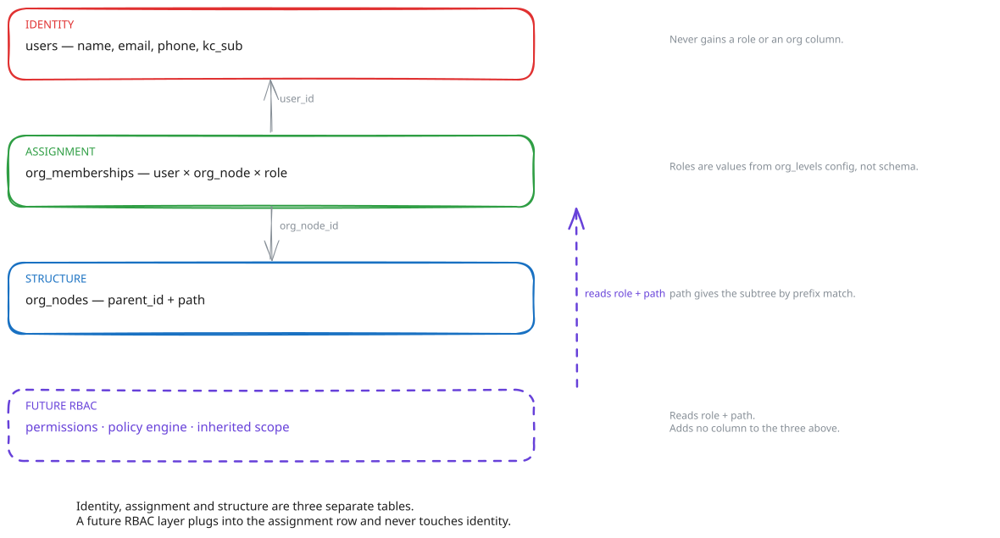

# Multi-Level Org Framework — Design

**Date:** 2026-09-04
**Status:** Design — for review
**Scope:** `aggregator-dpg`
**Diagrams:** editable sources in `assets/org-framework/*.excalidraw`, rendered to `.svg`

## Summary

Today an operator's identity _is_ their org row, so an org can hold exactly one person and a person can belong to exactly one org. This replaces that with three tables — `org_nodes`, `users`, `org_memberships` — and moves the level list into config. One user model serves every level, and authorisation attaches only to the membership row, which is the seam a later RBAC layer extends.

## Highlights

| Fact              | Detail                                                                                                     |
| ----------------- | ---------------------------------------------------------------------------------------------------------- |
| One user model    | `users` holds `name`, `email`, `phone`, `kc_sub`. No role column, no org column                            |
| One join table    | `org_memberships` = `(user, org_node, role)`. Many admins per org, one person in many orgs                 |
| Levels are config | Ordered `org_levels` array; array index is `depth`; 1..N levels                                            |
| One tree          | `org_nodes` covers every level including aggregators. `aggregator_orgs` and `aggregators` collapse into it |
| One approval rule | Every node and every membership is approved by an admin bound at a strict ancestor                         |
| RBAC-ready        | A permissions layer reads `role` + `path` and adds no column to the three tables                           |

---

## 1. Scope and terms

| Term            | Meaning                                                                            |
| --------------- | ---------------------------------------------------------------------------------- |
| **Org node**    | One row in the tree, at any level. The root, an intermediate org, or an aggregator |
| **Level**       | A rung in the tree, defined by position in `org_levels`. Config, not code          |
| **Leaf level**  | The last level. Aggregator instances. The only level that owns participant data    |
| **User**        | One human. One row in `users`, independent of any org                              |
| **Membership**  | `(user, org_node, role)`. The only thing that grants anything                      |
| **Admin**       | A membership with role `admin`, at any non-leaf level                              |
| **Coordinator** | A membership with role `coordinator`, at the leaf level                            |

Participants, bulk uploads, registration links, consent and profile records are out of scope. They keep their current shape and re-point from `aggregators.id` to the leaf `org_nodes.id`.

---

## 2. Problem

A person has no independent existence today. Identity is spread across four places, and every one of them ties a human to exactly one org.

| Where identity lives now | Fields                                                                    | Consequence                                           |
| ------------------------ | ------------------------------------------------------------------------- | ----------------------------------------------------- |
| Keycloak user            | `sub`, `phoneNumber`, `aggregator_id`, `aggregator_type`, `decision_made` | The KC attribute `aggregator_id` _is_ the scope key   |
| `aggregators`            | `name`, `contact` jsonb, generated `contact_phone` / `contact_email`      | The operating unit and its contact person are one row |
| `aggregator_orgs`        | `owner_email`, `owner_phone`, `owner_kc_sub`                              | One column set, so one admin per org                  |
| `aggregator_profile`     | `contact_name`                                                            | A fourth copy of a person's name                      |

What that blocks:

| #   | Blocked                     | Cause                                                                                                     |
| --- | --------------------------- | --------------------------------------------------------------------------------------------------------- |
| P1  | More than one admin per org | `aggregator_orgs.owner_*` is a single column set, not a table                                             |
| P2  | One person in two orgs      | `AuthContext.aggregatorId` is a single-valued token claim                                                 |
| P3  | Depth beyond two            | `aggregator_orgs` has no parent; `aggregators.parent_org_id` is the only link                             |
| P4  | Adding a level              | Level identity is implicit in table names, so a new level is a new table                                  |
| P5  | Roles as data               | `org_owner` and `coordinator` are Keycloak realm roles, so a role grants globally rather than at one node |
| P6  | RBAC without rework         | There is no row that means "this person may act here", so permissions have nowhere to attach              |

---

## 3. Structure



`org_levels` is an ordered array. Array index is the tier's `depth`; the array length is the depth of the tree.

```json
"org_levels": [
  { "name": "State",      "roles": ["admin"] },
  { "name": "Mandal",     "roles": ["admin"] },
  { "name": "District",   "roles": ["admin"] },
  { "name": "Aggregator", "roles": ["coordinator"], "leaf": true, "self_register": true }
]
```

| Field           | Required   | Meaning                                                                                   |
| --------------- | ---------- | ----------------------------------------------------------------------------------------- |
| array position  | —          | The tier's `depth`. Index 0 is the root                                                   |
| `name`          | Yes        | The deployment's word for the tier. Display only                                          |
| `roles`         | Yes        | Which membership roles may be created at this tier. Validated on write                    |
| `leaf`          | Last entry | Marks the operating tier. Those nodes carry `signalstack_org_id` and own participant data |
| `self_register` | No         | Whether a public registration form exists for this tier. Defaults to `false`              |

Two levels (`[Org, Aggregator]`) reproduces today's model. One level (`[Aggregator]`) reproduces the flat default. Six levels is six array entries.

---

## 4. Data model

Three tables. Nothing else is needed to express the hierarchy.



### `org_nodes` — structure

| Column               | Type           | Notes                                                                            |
| -------------------- | -------------- | -------------------------------------------------------------------------------- |
| `id`                 | uuid PK        |                                                                                  |
| `parent_id`          | uuid FK → self | Null only for the root                                                           |
| `depth`              | int            | Index into `org_levels`; must equal `parent.depth + 1`                           |
| `path`               | text           | `/`-delimited ancestor ids, e.g. `/r/m1/d4/a9/`. Subtree = `path LIKE '/r/m1/%'` |
| `slug`, `name`       | text           |                                                                                  |
| `status`             | enum           | `pending` \| `active` \| `inactive`                                              |
| `signalstack_org_id` | text           | Leaf only; null elsewhere                                                        |
| `domain_type`        | text           | Leaf only; `seeker` \| `provider`                                                |

`path` holds ids rather than slugs so a rename never rewrites it. A btree index on `path` serves prefix matching; `ltree` is an option if operators are wanted later, but it is not required.

### `users` — identity

| Column   | Type    | Notes                                                                                                    |
| -------- | ------- | -------------------------------------------------------------------------------------------------------- |
| `id`     | uuid PK |                                                                                                          |
| `name`   | text    |                                                                                                          |
| `email`  | text    | Unique, lowercased                                                                                       |
| `phone`  | text    | Unique, E.164                                                                                            |
| `kc_sub` | text    | The Keycloak `sub` claim — the join key to the login account. Unique, nullable until the IdP user exists |
| `status` | enum    | `invited` \| `active` \| `disabled`                                                                      |

One row per human, whatever level they operate at. No role column and no org column: a person's record does not change when their memberships do.

`kc_sub` is the only field the IdP owns. It is not the primary key, so `org_memberships` never carries a vendor identifier and the adapter stays swappable (`services/idp-admin/interface.ts`). It also replaces the current reverse pointer: today the Keycloak user carries an `aggregator_id` attribute back into Postgres, which is the second link this removes.

### `org_memberships` — assignment

| Column        | Type                     | Notes                                         |
| ------------- | ------------------------ | --------------------------------------------- |
| `id`          | uuid PK                  |                                               |
| `user_id`     | uuid FK → `users.id`     |                                               |
| `org_node_id` | uuid FK → `org_nodes.id` |                                               |
| `role`        | text                     | Must appear in `org_levels[node.depth].roles` |
| `status`      | enum                     | `pending` \| `active` \| `revoked`            |

| Guard                   | Definition                                                                                                                                               |
| ----------------------- | -------------------------------------------------------------------------------------------------------------------------------------------------------- |
| One root                | Unique partial index on a constant, `WHERE parent_id IS NULL`                                                                                            |
| No level skipping       | Trigger: `depth = parent.depth + 1`                                                                                                                      |
| No cycles               | Trigger recomputes `path` on parent change; rejects a descendant as the new parent                                                                       |
| Role fits the level     | Check on write against `org_levels[depth].roles`                                                                                                         |
| Leaf-only columns       | Check: `signalstack_org_id` and `domain_type` are non-null only at the leaf depth                                                                        |
| No duplicate membership | `UNIQUE (user_id, org_node_id, role)`                                                                                                                    |
| Leaf slug is global     | `UNIQUE (slug)` at leaf depth — `aggregators.org_slug` is already globally unique and namespaces public registration URLs (`apps/api/src/config.ts:139`) |
| Sibling slugs elsewhere | `UNIQUE (parent_id, slug) WHERE status IN ('pending','active')`                                                                                          |

---

## 5. Rules and creation

|                       | Root                           | Intermediate                   | Leaf (aggregator) |
| --------------------- | ------------------------------ | ------------------------------ | ----------------- |
| Node count            | Exactly 1                      | 0..N per parent                | 0..N per parent   |
| Allowed roles         | `admin`                        | `admin`                        | `coordinator`     |
| Owns participant data | No                             | No                             | Yes               |
| Creates child nodes   | Yes                            | Yes                            | No                |
| Approves              | Its children and their members | Its children and their members | —                 |

One rule covers every create:

> A node and a membership are both approved by an `admin` whose membership sits at a **strict ancestor** of the target node, nearest active ancestor first. The root and its first admin are seeded at bootstrap.

| What is created         | By whom                                                   | Identity step                                                                                    |
| ----------------------- | --------------------------------------------------------- | ------------------------------------------------------------------------------------------------ |
| Root node + first admin | Bootstrap                                                 | `users` row seeded, membership `active`                                                          |
| Intermediate node       | Parent's admin                                            | Node `active` on create; invited admin gets a `users` row (`invited`) and a `pending` membership |
| Leaf node               | Parent's admin, or self-registration when `self_register` | Node `pending` until the ancestor admin approves                                                 |
| Coordinator             | Self-registration or invite                               | `users` row plus a `pending` membership at the leaf                                              |

An invite that matches an existing `email` or `phone` reuses that `users` row and adds a membership. That is how one person becomes an admin of two districts, or an admin at one level and a coordinator at another, without a second identity.

---

## 6. RBAC readiness

The requirement is that a later RBAC design lands without reworking these tables. That holds because the model separates three things that are currently one row.



| Property                         | What gives it                                                                                             |
| -------------------------------- | --------------------------------------------------------------------------------------------------------- |
| Identity never encodes authority | `users` has no role and no org column, so adding permissions cannot change it                             |
| Authority has one home           | `org_memberships` is the only row an authorisation decision reads                                         |
| Roles are data                   | Role values come from `org_levels`; a new role is a config edit, not a migration                          |
| Scope is already computable      | `org_nodes.path` yields the subtree by prefix, so inherited permission is a prefix match, not a new table |
| Many-to-many is already there    | Multiple admins per org and one person in many orgs need no schema change                                 |

A permissions layer is then additive: a `role_permissions` table keyed on role name, and a decision function of the shape

```
allow(user, action, node)
  ⇔ ∃ membership m for user, where
      action ∈ permissions(m.role)
      and ( m.org_node_id = node.id  or  node.path LIKE m.node.path || '%' )
```

Nothing in that reads `users`, and nothing in it needs a column that this design does not already create. Whether inheritance is on, and which actions each role carries, are the RBAC design's decisions — not this one's.

The token contract changes once, now: today `AuthContext.aggregatorId` comes from a Keycloak attribute and is single-valued. It becomes `sub` only, with the API resolving memberships from `kc_sub`. That removes the single-org assumption at its source (P2) and is the prerequisite for everything above.

---

## 7. Migration

| Step | Change                                                                                                                                                            |
| ---- | ----------------------------------------------------------------------------------------------------------------------------------------------------------------- |
| 1    | Create `org_nodes`, `users`, `org_memberships`. Nothing reads them yet                                                                                            |
| 2    | Backfill: one `org_nodes` row per `aggregator_orgs` row and per `aggregators` row, parented per `parent_org_id`; synthetic root if the deployment has none        |
| 3    | Backfill `users` from `aggregator_orgs.owner_email` / `owner_phone` / `owner_kc_sub` and from `aggregators.contact`, deduplicated on email and phone              |
| 4    | Create memberships: `admin` for each org owner, `coordinator` for each aggregator contact                                                                         |
| 5    | Re-point `aggregator_profile`, `bulk_uploads`, `registration_links`, `participants`, `aggregator_consent_record` from `aggregators.id` to the leaf `org_nodes.id` |
| 6    | Switch auth to resolve memberships from `kc_sub`; retire the `aggregator_id` Keycloak attribute                                                                   |
| 7    | Drop `aggregator_orgs` and `aggregators`                                                                                                                          |

Steps 1–4 are additive and reversible. Step 5 is the cutover. `ORG_HIERARCHY_ENABLED` is replaced by `org_levels.length`.

Assertion to run as part of step 4, not as a script someone remembers: every pre-migration aggregator has exactly one leaf node and at least one `coordinator` membership.

---

## 8. Open questions

| #   | Question                                                                        | Why it matters                                                                                 |
| --- | ------------------------------------------------------------------------------- | ---------------------------------------------------------------------------------------------- |
| Q1  | Can a leaf node have an `admin` as well as coordinators?                        | Decides whether a coordinator can manage peers, or whether that always escalates to the parent |
| Q2  | Does an intermediate admin see participant data in its subtree, or only counts? | Decides whether the RBAC layer needs a PII boundary from day one                               |
| Q3  | Can a node move to a new parent, and who may do it?                             | Affects the `path` rewrite trigger and any in-flight approvals                                 |
| Q4  | Is `email` or `phone` the identity key when only one is supplied?               | Both are unique; an invite matching on one and conflicting on the other needs a rule           |
| Q5  | Should `org_levels` changes be validated against existing data at startup?      | Shortening the array would orphan nodes below the new leaf depth                               |
