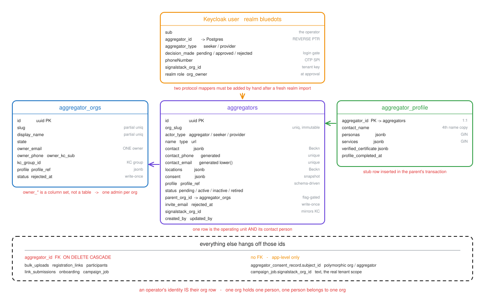
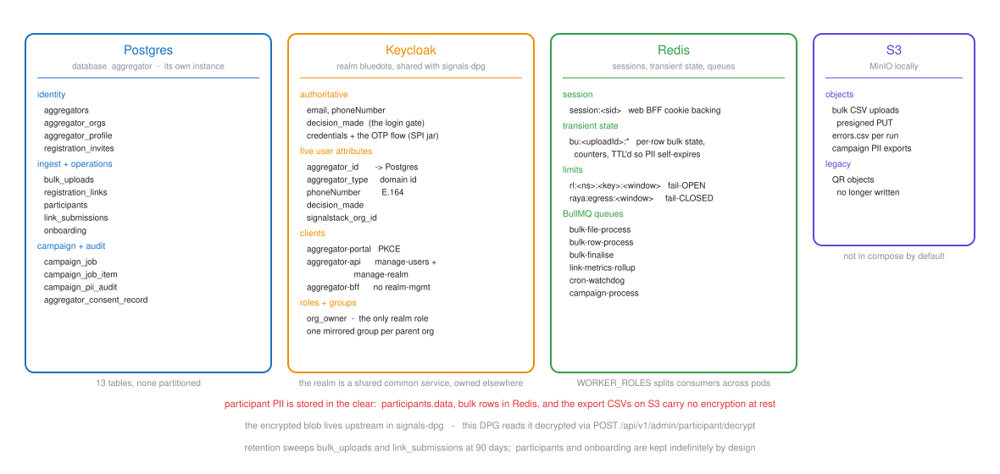
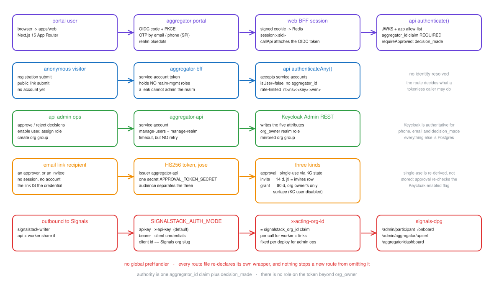

# Aggregator user model — current state

**Date:** 2026-09-10
**Status:** Current state, as implemented
**Scope:** `aggregator-dpg`
**Diagrams:** editable sources in `assets/user-model/*.excalidraw`, rendered to `.svg`

## Summary

An operator's identity is spread across four places, and every one of them ties
a human to exactly one org. There is no `users` table: the `aggregators` row is
both the operating unit and its contact person, and Keycloak carries a reverse
pointer back to it. Authority is one token claim plus an approval flag.

## Highlights

| Fact                            | Detail                                                                                                                |
| ------------------------------- | --------------------------------------------------------------------------------------------------------------------- |
| No user table                   | Identity lives in Keycloak attributes, `aggregators`, `aggregator_orgs.owner_*` and `aggregator_profile.contact_name` |
| One org, one person             | `aggregators` is the operating unit _and_ the contact. `aggregator_orgs` has one `owner_*` column set                 |
| Two levels, flag-gated          | `aggregators.parent_org_id` is the only hierarchy link, and only under `ORG_HIERARCHY_ENABLED`                        |
| Authority is a claim            | `aggregator_id` plus `decision_made`. The only realm role is `org_owner`                                              |
| Profiles are schema-driven      | `profile jsonb` + `profile_ref` naming the schema variant, so a form revision needs no migration                      |
| Participant PII is in the clear | `participants.data`, the bulk rows in Redis, and the export CSVs carry no encryption at rest                          |

---

## 1. Vocabulary

| Term          | Meaning                                                                           | Example                  |
| ------------- | --------------------------------------------------------------------------------- | ------------------------ |
| aggregator    | A row in `aggregators`. The operating unit that onboards participants             | An ITI, a placement cell |
| coordinator   | The human who operates an aggregator. Not a separate row                          | -                        |
| parent org    | A row in `aggregator_orgs`. Owns many aggregators when the flag is on             | A district body          |
| actor type    | `aggregator` \| `seeker` \| `provider`. A Postgres enum on the row                | -                        |
| domain / type | The network's domain id this aggregator serves. Plain `text` since migration 0011 | `seeker`, `tutor`        |
| participant   | A person onboarded through bulk upload or a registration link                     | -                        |
| campaign      | An async job over a set of upstream items: export, voice, email                   | -                        |

The word "user" does not appear in the schema. Every identity is an
`aggregators` or `aggregator_orgs` row plus a Keycloak user keyed by attribute.

---

## 2. Identity data model

Thirteen tables, none partitioned, in this DPG's own `aggregator` database.

### `aggregators`

| Group          | Columns                                                                   | Notes                                                                               |
| -------------- | ------------------------------------------------------------------------- | ----------------------------------------------------------------------------------- |
| Key            | `id uuid PK`, `org_slug`                                                  | `org_slug` is derived from `name` at INSERT and made immutable by a trigger         |
| Classification | `actor_type`, `type`, `name`, `url`                                       | `type` is `NULL` when `actor_type='aggregator'`, by CHECK                           |
| Contact        | `contact jsonb`, `contact_phone`, `contact_email`                         | The two scalars are generated columns, both unique — they are the login lookup keys |
| Beckn          | `locations jsonb`                                                         | Optional location list                                                              |
| Consent        | `consent jsonb`                                                           | T&C snapshot taken before the account exists                                        |
| Schema payload | `profile jsonb`, `profile_ref`                                            | Only fields with no column of their own. `profile_ref` names the variant            |
| Lifecycle      | `status`, `rejected_at`, `created_by`, `updated_by`                       | `rejected_at` is write-once                                                         |
| Links          | `parent_org_id` → `aggregator_orgs`, `invite_email`, `signalstack_org_id` | All three nullable                                                                  |

### `aggregator_orgs`

| Column                                            | Notes                                                                                        |
| ------------------------------------------------- | -------------------------------------------------------------------------------------------- |
| `id uuid PK`, `slug`, `display_name`              | Both unique only over `status IN ('pending','active')`, so a rejected org never blocks reuse |
| `state`                                           | The only typed address field; the rest of the address lives in `profile`                     |
| `owner_email`, `owner_phone`, `owner_kc_sub`      | One column set, so one admin per org                                                         |
| `kc_group_id`                                     | A mirrored Keycloak group, kept for future authz                                             |
| `profile`, `profile_ref`, `status`, `rejected_at` | Same shape as `aggregators`                                                                  |

### `aggregator_profile` and `registration_invites`

`aggregator_profile` is 1:1 on `aggregators.id`, with a stub row inserted in the
parent's transaction so the invariant always holds. It carries `contact_name` —
a fourth copy of a person's name — plus `personas`, `services` and
`verified_certificate` as GIN-indexed jsonb, and a `profile_completed_at`
checkpoint that gates Beckn catalog visibility.

`registration_invites` exists because an invitee has no Keycloak user yet, so
the row is what buys single-use, revocation and leak attribution. `jti` is the
primary key and the invite token's `sub`; a partial unique index on
`(parent_org_id, email) WHERE status='pending'` keeps exactly one live invite.

### Table inventory

| Layer    | Tables                                                                         |
| -------- | ------------------------------------------------------------------------------ |
| Identity | `aggregators`, `aggregator_orgs`, `aggregator_profile`, `registration_invites` |
| Ingest   | `bulk_uploads`, `registration_links`, `participants`, `link_submissions`       |
| Metrics  | `onboarding` — one row per bulk batch, one per (aggregator, link, hour)        |
| Campaign | `campaign_job`, `campaign_job_item`, `campaign_pii_audit`                      |
| Consent  | `aggregator_consent_record` — append-only, polymorphic on `subject_type`       |

Six tables carry `aggregator_id` as a real FK with `ON DELETE CASCADE`.
`aggregator_consent_record.subject_id` is polymorphic with no FK, and
`campaign_job.signalstack_org_id` is plain `text` — yet it, not
`aggregator_id`, is the scope every campaign read, list and cap query filters
on.

`participants` dedupes on `(aggregator_id, type, participant_id)`, where
`participant_id` is the external id from the data source. The same external id
may exist under different aggregators.

---

## 3. Where identity lives

| Store    | Owns                                                       | Notes                                                      |
| -------- | ---------------------------------------------------------- | ---------------------------------------------------------- |
| Postgres | The org rows, ingest, metrics, campaigns, consent          | Its own `aggregator` database, separate from signals-dpg's |
| Keycloak | Email, phone, credentials, approval state                  | Realm `bluedots`, shared with signals-dpg                  |
| Redis    | Sessions, transient bulk state, rate limits, BullMQ queues | Losing it logs everyone out and strands in-flight uploads  |
| S3       | Bulk CSVs, `errors.csv`, campaign exports                  | MinIO locally, behind the `storage` compose profile        |

### The Keycloak split

Keycloak is authoritative for `phoneNumber`, `email` and `decision_made`; those
values are mirrored into `aggregators.contact` for query and Beckn passthrough.
Everything else is Postgres.

| Attribute            | Purpose                                                                                                               |
| -------------------- | --------------------------------------------------------------------------------------------------------------------- |
| `aggregator_id`      | The reverse pointer to Postgres. Without its protocol mapper the profile endpoint returns `403 MISSING_AGGREGATOR_ID` |
| `aggregator_type`    | Enforces that an aggregator only operates on the domain it registered as                                              |
| `phoneNumber`        | Read by the OTP authenticator SPI                                                                                     |
| `decision_made`      | `pending` \| `approved` \| `rejected`. The login gate                                                                 |
| `signalstack_org_id` | Written after the Signals upsert at approval; backfilled at login when missing                                        |

| Client              | Role                                                                                               |
| ------------------- | -------------------------------------------------------------------------------------------------- |
| `aggregator-portal` | Web OIDC code flow + PKCE                                                                          |
| `aggregator-api`    | Admin ops. Holds `manage-users` and `manage-realm`                                                 |
| `aggregator-bff`    | Anonymous proxy. Holds no realm-management roles, so a BFF secret leak cannot administer the realm |

`org_owner` is the only realm role, and it ships even when
`ORG_HIERARCHY_ENABLED` is off. Two protocol mappers (`aggregator_id`,
`phone_number`) must be added by hand after a fresh realm import.

The two Redis limiters fail in opposite directions on purpose: the request
rate limiter is fail-open, so an outage never blocks a legitimate caller, while
the voice egress gate is fail-closed, so an outage stops outbound calls.

### PII at rest

There is none. `participants.data` holds the participant payload in plaintext,
the bulk rows in Redis likewise, and the campaign export CSVs are written
unencrypted. The encrypted blob lives upstream: this DPG reads it decrypted
through `POST /api/v1/admin/participant/decrypt`. Retention sweeps
`bulk_uploads` and `link_submissions` at 90 days; `participants` and
`onboarding` are kept indefinitely by design.

---

## 4. How a request gets an identity

| Path                | Credential                                 | Resolves to                       | Guard                                              |
| ------------------- | ------------------------------------------ | --------------------------------- | -------------------------------------------------- |
| Portal human        | OIDC token via the web BFF's signed cookie | `AuthContext` with `aggregatorId` | `authenticate()` then `requireApproved()`          |
| Anonymous public    | `aggregator-bff` service-account token     | `AnyAuthContext`, `isUser=false`  | `authenticateAny()` plus a rate limit              |
| Admin ops           | `aggregator-api` service-account token     | Keycloak Admin REST               | `azp` allow-list                                   |
| Email link          | An HS256 JWT in the URL                    | The subject named in the token    | Signature, issuer, audience, plus a state re-check |
| Outbound to Signals | `x-api-key` or a client-credentials bearer | Signals' service user             | `SIGNALSTACK_AUTH_MODE`                            |

Token verification is issuer-scoped **and** client-scoped:
`KEYCLOAK_ALLOWED_AZP` (default `aggregator-portal,aggregator-api,aggregator-bff`)
is checked on both the user and service-account paths, and
`KEYCLOAK_EXPECTED_AUDIENCE` adds an opt-in audience check. Both no-op when
unset. A route may narrow the list further — the campaign endpoints accept only
`campaign-manager`.

### The three email-link tokens

All three are HS256 via `jose`, issued by `aggregator-api` and signed with
`APPROVAL_TOKEN_SECRET`. The audience separates them.

| Token    | Lifetime | Single-use by                                                                                      |
| -------- | -------- | -------------------------------------------------------------------------------------------------- |
| approval | Short    | Re-reading the Keycloak `enabled` flag, so nothing is stored                                       |
| invite   | 14 days  | The `registration_invites` row it points at                                                        |
| grant    | 90 days  | Nothing — it is the org owner's only surface, because their Keycloak user is deliberately disabled |

### What authority actually exists

| Question                            | Answered by                                              |
| ----------------------------------- | -------------------------------------------------------- |
| Which org is this caller?           | The `aggregator_id` claim, never the request body        |
| May they act at all?                | `decision_made == 'approved'`                            |
| Which domain may they operate on?   | The `aggregator_type` claim                              |
| Which upstream tenant do they read? | The `signalstack_org_id` claim                           |
| Are they an org owner?              | The `org_owner` realm role                               |
| Is this a service account?          | `preferred_username` matching `service-account-<client>` |

That last row is the correct discriminator, established by the campaign dump
route. An older check tests `subject.startsWith('service-account-')`, which can
never match because `sub` is a UUID for service accounts too — a known-broken
gate, tracked separately, that must not be copied into a new route.

There is no permission table and no role-permission map. There is also no
global Fastify `preHandler`: every route file re-declares its own thin wrapper
around the shared module, so nothing prevents a new route from omitting the
call.

---

## 5. How an aggregator comes to exist

| Step      | What happens                                                                                                                                                                                    |
| --------- | ----------------------------------------------------------------------------------------------------------------------------------------------------------------------------------------------- |
| Submit    | The public form creates the `aggregators` row (plus its `aggregator_profile` stub) at `status='pending'`, and a disabled Keycloak user                                                          |
| Consent   | `recordRegistrationConsent` writes the ledger row **before** any provisioning. On failure the just-created row is deleted and the request fails `CONSENT_WRITE_FAILED`                          |
| Review    | A signed approval link is emailed — to the platform admin, or to the parent org's owner when the coordinator named an org                                                                       |
| Approve   | `pending → active`, CAS-guarded by `UPDATE ... WHERE id=? AND status='pending'`, so a double-click cannot double-provision                                                                      |
| Provision | The Keycloak user is enabled, `decision_made='approved'` is written, `POST /api/v1/admin/aggregator/upsert` mirrors the org into Signals, and the returned id is stored as `signalstack_org_id` |
| Reject    | `pending → inactive` with a write-once `rejected_at`. No CAS, because rejection has no provisioning to double-fire                                                                              |

`retired` exists in the status type but no transition in the approval routes
reaches it.

**Rejection cooling.** A rejected applicant cannot re-register until
`REGISTRATION_COOLING_MINUTES` (default 720) has elapsed since `rejected_at`,
measured from that write-once column rather than the mutable `updated_at`.
Inside the window the submit returns `409 REGISTRATION_COOLING` with a
`retry_after`. Once elapsed the **same row is revived** to `pending` and the
review link re-sent; the disabled Keycloak user and group stay intact.

**Org hierarchy.** With `ORG_HIERARCHY_ENABLED` off, `/v1/orgs*` and
`/admin/v1/orgs*` are never registered, so they return 404 rather than 403,
`parent_org_id` stays null, and the migrations are inert. With it on, a parent
org runs its own registration and approval flow, and coordinator registration
requires a valid active `org_id`. The token↔`parent_org_id` binding on the
decision path is enforced **regardless of the flag** — a data-level invariant,
not a gated feature.

### What it reads and writes upstream

| Endpoint                                                | Direction                                         |
| ------------------------------------------------------- | ------------------------------------------------- |
| `POST /api/v1/admin/aggregator/upsert`                  | Write — mirrors this org into Signals at approval |
| `POST /api/v1/admin/participant`, `/admin/onboard`      | Write — the only participant write paths          |
| `POST /api/v1/admin/participant/decrypt`                | Read — decrypted profiles for export and voice    |
| `GET /api/v1/aggregator/dashboard`, `/dashboard/export` | Read                                              |
| `POST /api/v1/network/item/fetch`, `/fetch_local`       | Read                                              |

`SIGNALSTACK_CLIENT_ID` must equal this aggregator's Signals
`organization.slug`, asserted at boot. `onboard` is no longer idempotent — it
always inserts, bounded only by the upstream profile cap.
